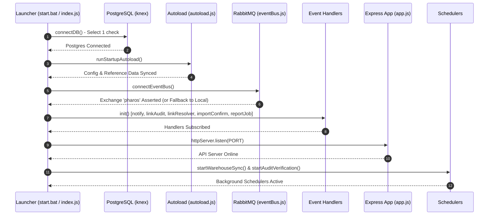
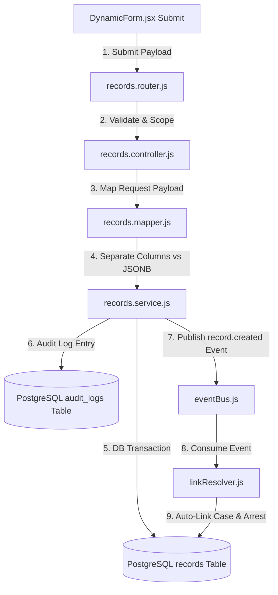
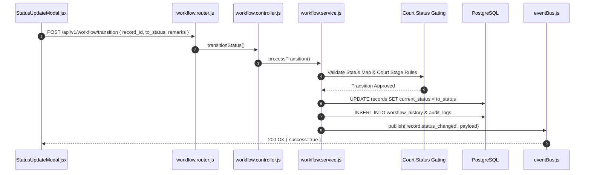

# System Execution Flow & Lifecycle (FLOW.md)

## Instructions for Future AI Agents
- **Read `FLOW.md`** before modifying important execution paths.
- **Verify execution against source code**: Source code is the ultimate source of truth.
- **Trace actual paths**: Verify entry points, function arguments, service layers, and database operations.
- **Update `FLOW.md`** whenever execution paths, API contracts, or event flows change.
- **Do not invent abstractions**: Describe how components actually communicate today.
- **Maintain the developer's mental model as a first-class concern**.

---

## Core Execution Flows

### 1. System Startup & Bootstrap Sequence

This flow describes the startup sequence of the backend application server from initial launch to background worker readiness.

#### Entry Point
`node index.js` or `npm run dev` (`backend/index.js`)

#### Sequence Diagram



#### Execution Steps & Code Reference
1. **Database Connection Check**: [`backend/src/config/db.js`](file:///d:/DPI/FIR/pharos-prototype/backend/src/config/db.js) calls `db.raw('SELECT 1')` with retries.
2. **Auto-Load Baseline Data**: [`backend/src/bootstrap/autoload.js`](file:///d:/DPI/FIR/pharos-prototype/backend/src/bootstrap/autoload.js) runs configuration synchronization and loads reference datasets.
3. **Connect Event Bus**: [`backend/src/events/eventBus.js`](file:///d:/DPI/FIR/pharos-prototype/backend/src/events/eventBus.js) connects to RabbitMQ AMQP server or initializes local EventEmitter fallback.
4. **Initialize Event Consumers**: Registers asynchronous event listeners for:
   - `notifyHandler.init()` ([`backend/src/events/handlers/notifyHandler.js`](file:///d:/DPI/FIR/pharos-prototype/backend/src/events/handlers/notifyHandler.js))
   - `linkAuditHandler.init()` ([`backend/src/events/handlers/linkAuditHandler.js`](file:///d:/DPI/FIR/pharos-prototype/backend/src/events/handlers/linkAuditHandler.js))
   - `linkResolver.init()` ([`backend/src/events/handlers/linkResolver.js`](file:///d:/DPI/FIR/pharos-prototype/backend/src/events/handlers/linkResolver.js))
   - `importConfirmHandler.init()` ([`backend/src/events/handlers/importConfirmHandler.js`](file:///d:/DPI/FIR/pharos-prototype/backend/src/events/handlers/importConfirmHandler.js))
   - `reportJobHandler.init()` ([`backend/src/events/handlers/reportJobHandler.js`](file:///d:/DPI/FIR/pharos-prototype/backend/src/events/handlers/reportJobHandler.js))
5. **Start HTTP Server**: [`backend/src/app.js`](file:///d:/DPI/FIR/pharos-prototype/backend/src/app.js) mounts Express middleware, security layers, API routers, and listens on `PORT` (default `5000`).
6. **Launch Schedulers**: Starts cron jobs for warehouse synchronization ([`warehouse.scheduler.js`](file:///d:/DPI/FIR/pharos-prototype/backend/src/modules/warehouse/warehouse.scheduler.js)) and audit verification ([`audit.scheduler.js`](file:///d:/DPI/FIR/pharos-prototype/backend/src/modules/audit/audit.scheduler.js)).

---

### 1.5 Configuration Synchronization Flow (Field Registry & Proformas)

This flow explains how dynamic forms and report structures are managed via static config files instead of SQL migrations.

#### Flowchart

```mermaid
flowchart TD
    A[NPM Script / Autoload] -->|1. Run sync-config-core.mjs| B[sync-config-core.mjs]
    B -->|2. Read config/fields/*.json| C[Config JSON Files]
    C -->> B: JSON Field Definitions (e.g. missing.json)
    B -->|3. Expand Placeholders| D[geoData.js]
    B -->|4. Validate Storage Mapping| E[(PostgreSQL information_schema)]
    B -->|5. Hash Checksum Comparison| F[(PostgreSQL field_registry Table)]
    B -->|6. Upsert or Deactivate Fields| F
```

#### Execution Steps & Code Reference
1. **Trigger**: Triggered manually via `npm run sync-config` or automatically on startup via `autoload.js`.
2. **Read JSON Configs**: [`backend/scripts/lib/sync-config-core.mjs`](file:///d:/DPI/FIR/pharos-prototype/backend/scripts/lib/sync-config-core.mjs) reads files like `config/fields/missing.json`.
3. **Validate & Expand**: Replaces `$NATIONALITY` and geo placeholders with options from `geoData.js`. Validates the `storage` configuration (table/column) against live `information_schema`.
4. **Idempotent Upsert**: Computes a SHA-256 hash of each field. If the hash matches the DB, it does nothing. If it differs, it upserts the `field_registry` row. Fields missing from JSON are set to `is_active = false`.
5. **Hybrid Roles (e.g., MISSING_CHILD)**: The sync script strictly validates storage entity roles against its hardcoded `ROLES` constant to prevent schema mismatches.

---

### 2. Dynamic Form Schema Generation & Field Resolution Flow

This flow describes how the frontend fetches dynamic form structures and renders controls based on record type and user context.

#### Entry Point
`useFormSchema(recordType, caseType)` in React component (`NewRecord.jsx` / `DynamicForm.jsx`).

#### Flowchart

```mermaid
flowchart TD
    A[React Page / NewRecord.jsx] -->|1. Request Schema| B[useFormSchema.js]
    B -->|2. HTTP GET /api/v1/fields/schema/:recordType| C[fields.router.js]
    C -->|3. authMiddleware| D[fields.controller.js]
    D -->|4. getFieldsForRecordType()| E[fields.service.js]
    E -->|5. Query field_registry DB Table| F[(PostgreSQL)]
    F -->> E: Raw Field Definitions
    E -->|6. Attach Dropdown Lookups & Enforce UID Readonly| D
    D -->> B: JSON Schema Payload { sections, fields }
    B -->|7. Normalize Fields & Rules| G[DynamicForm.jsx]
    G -->|8. Render Form Controls| H[FieldRenderer.jsx]
```

#### Execution Steps & Code Reference
1. **Frontend Trigger**: Component mounts and calls `useFormSchema(recordType)` ([`frontend/src/hooks/useFormSchema.js`](file:///d:/DPI/FIR/pharos-prototype/frontend/src/hooks/useFormSchema.js)).
2. **HTTP Request**: React Query sends `GET /api/v1/fields/schema/:recordType?caseType=...` with user authentication credentials.
3. **Route Handling**: Express routes request to [`fields.controller.js`](file:///d:/DPI/FIR/pharos-prototype/backend/src/modules/fields/fields.controller.js) `getFormSchema()`.
4. **Service & Database Resolution**: [`fields.service.js`](file:///d:/DPI/FIR/pharos-prototype/backend/src/modules/fields/fields.service.js) queries `field_registry` for active fields applicable to `recordType`.
5. **Lookup & Gating Processing**:
   - Dynamically resolves option lookups (Acts, Sections, Minor Crime Heads, Statuses).
   - Marks system UID fields (`uid`, `person_uid`, `*_npr`, `*_uid`) as `readonly: true`.
   - Attaches the global layout metadata (`section_order`, `repeater_meta`, `section_labels`) from `formLayout.js`.
6. **Frontend Normalization & Rendering**:
   - [`useFormSchema.js`](file:///d:/DPI/FIR/pharos-prototype/frontend/src/hooks/useFormSchema.js) normalizes validation rules and exposes both `schema` and `layout`.
   - [`DynamicForm.jsx`](file:///d:/DPI/FIR/pharos-prototype/frontend/src/components/forms/DynamicForm.jsx) parses the layout to order sections, apply repeater logic, and passes individual controls to [`FieldRenderer.jsx`](file:///d:/DPI/FIR/pharos-prototype/frontend/src/components/forms/FieldRenderer.jsx).

---

### 3. Record Creation, Ingestion & Event Dispatch Flow

This flow describes the lifecycle of submitting a new record from form submission to database storage and background event processing.

#### Entry Point
Form Submit in `DynamicForm.jsx` → `POST /api/v1/records`

#### Flowchart



#### Execution Steps & Code Reference
1. **Form Submission**: [`DynamicForm.jsx`](file:///d:/DPI/FIR/pharos-prototype/frontend/src/components/forms/DynamicForm.jsx) collects values and invokes `api.post('/records', payload)`.
2. **Controller Validation**: [`records.controller.js`](file:///d:/DPI/FIR/pharos-prototype/backend/src/modules/records/records.controller.js) enforces user jurisdiction (`ps_id`, `district_id`) and user role permissions.
3. **Data Mapping**: [`records.mapper.js`](file:///d:/DPI/FIR/pharos-prototype/backend/src/modules/records/records.mapper.js) maps form fields to top-level SQL columns (`record_type`, `record_number`, `ps_id`, `current_status`) and packs non-column attributes into the `data` JSONB object.
4. **Service & Transaction**: [`records.service.js`](file:///d:/DPI/FIR/pharos-prototype/backend/src/modules/records/records.service.js) opens a Knex transaction:
   - Generates unique record system UID (`record_uid`).
   - Inserts row into `records` table.
   - Appends entry to `audit_logs` table with calculated SHA-256 hash.
5. **Event Emission**: Publishes `record.created` event via [`eventBus.js`](file:///d:/DPI/FIR/pharos-prototype/backend/src/events/eventBus.js).
6. **Async Link Resolution**: Background consumer [`linkResolver.js`](file:///d:/DPI/FIR/pharos-prototype/backend/src/events/handlers/linkResolver.js) processes the event and automatically creates links between related Case, Arrest, and Missing Person entities.

---

### 4. Record Workflow State Transition & Court Gating Review Flow

This flow describes status changes (e.g., Head Constable submit → SHO review → HQ receive or Send Back).

#### Entry Point
`POST /api/v1/workflow/transition`

#### Sequence Diagram



#### Execution Steps & Code Reference
1. **Workflow Action**: User triggers status transition from [`StatusUpdateModal.jsx`](file:///d:/DPI/FIR/pharos-prototype/frontend/src/components/records/StatusUpdateModal.jsx) or [`RecordDetail.jsx`](file:///d:/DPI/FIR/pharos-prototype/frontend/src/pages/sho/RecordDetail.jsx).
2. **Status Map Gating**: Backend checks `case-status-map.json` and court gating rules to ensure valid transition (e.g., preventing invalid state jumps or direct workout edits).
3. **Database Update**: Updates `records.current_status`, writes entry to `workflow_history`, and logs tamper-evident audit hash.
4. **Notification Event**: Emits `record.status_changed` event to [`notifyHandler.js`](file:///d:/DPI/FIR/pharos-prototype/backend/src/events/handlers/notifyHandler.js) to issue inbox notifications to relevant officers.

---

### 5. Multi-Sheet Excel & PHQ Diary Report Generation Flow

This flow describes how reports are compiled and executed through the external Python worker.

#### Entry Point
`POST /api/v1/reports/phq-diary/generate` or `POST /api/v1/reports/custom-excel`

#### Flowchart

```mermaid
flowchart TD
    A[Frontend ReportBuilder / CustomExcelBuilder] -->|1. Generate Request| B[reports.router.js]
    B -->|2. Request Validation| C[reports.controller.js]
    C -->|3. Build SQL Criteria| D[diary-query-builder.js]
    D -->|4. Execute SQL Queries| E[(PostgreSQL)]
    E -->> D: Tabular Records Data
    C -->|5. Spawn Process (python generator.py)| F[Python Worker Engine]
    F -->|6. Load Template & Apply pandas/openpyxl| F
    F -->> C: Generated .xlsx File Buffer
    C -->> A: HTTP Download Response (Content-Disposition: attachment)
```

#### Execution Steps & Code Reference
1. **Report Trigger**: User configures report scope, station filters, and date range in report builder frontend pages.
2. **Query Building**: [`diary-query-builder.js`](file:///d:/DPI/FIR/pharos-prototype/backend/src/modules/report-engine/shared/diary-query-builder.js) constructs dynamic PostgreSQL query specs for requested stations and crime heads.
3. **Sub-process Spawn**: [`reports.controller.js`](file:///d:/DPI/FIR/pharos-prototype/backend/src/modules/reports/reports.controller.js) spawns `python_worker/generator.py` passing JSON specifications via standard stdin/arguments.
4. **Excel Formatting**: [`python_worker/generator.py`](file:///d:/DPI/FIR/pharos-prototype/python_worker/generator.py) builds formatted multi-sheet Excel workbooks with executive styling, formula injection protection, and multi-column headers.
5. **File Delivery**: Buffer is streamed back to client as executable Excel attachment.

---

### 6. Audit Log Creation & Cryptographic Hash-Chain Verification Flow

This flow describes the tamper-evident cryptographic security verification process.

#### Entry Point
Scheduler in `backend/index.js` → `startAuditVerification()` (`audit.scheduler.js`).

#### Flowchart

```mermaid
flowchart TD
    A[audit.scheduler.js Cron] -->|1. Trigger Periodic Audit Check| B[audit.service.js]
    B -->|2. Fetch Sequential Audit Entries| C[(PostgreSQL audit_logs Table)]
    C -->> B: Sequential Hash Array
    B -->|3. Recompute SHA-256 (prev_hash + payload)| B
    B -->|4. Compare Computed vs Stored Hash| D{Hash Match?}
    D --|Yes| E[Log Audit Verified - Clean]
    D --|No Break Detected| F[Trigger Emergency Security Action]
    F -->|Freeze Record & Log Warning| G[(Set records.is_frozen = true)]
```

#### Execution Steps & Code Reference
1. **Periodic Trigger**: [`audit.scheduler.js`](file:///d:/DPI/FIR/pharos-prototype/backend/src/modules/audit/audit.scheduler.js) executes on scheduled interval.
2. **Fetch Log Sequence**: [`audit.service.js`](file:///d:/DPI/FIR/pharos-prototype/backend/src/modules/audit/audit.service.js) queries `audit_logs` ordered by sequential ID.
3. **Hash Calculation**: Computes `SHA256(previous_hash + payload)` for each entry and compares with recorded `entry_hash`.
4. **Tamper Action**: If a discrepancy is detected, marks affected records as frozen (`is_frozen = true`) and raises security alert logs.

---

## Current Development Context

- **Active Git Branch**: `collab/Vaibhav`
- **Active Feature Work**:
  - **Person UID Read-Only Gating**: Enforcing read-only input behavior for all person UID/NPR fields across forms.
  - **Court Status Gating**: Blocking invalid status transitions and direct workout status updates in case management workflow.
  - **Worked-Out Fields Migration**: Database schema updates supporting structured worked-out tracking for cases.
  - **Unified Record Type Badges**: Frontend color-coding component ([`RecordTypeBadge.jsx`](file:///d:/DPI/FIR/pharos-prototype/frontend/src/components/common/RecordTypeBadge.jsx)) unifying visual badges across all 7 record types (`CASE`, `ARREST`, `UIDB`, `MISSING`, `PCR_CALL`, `LEFT_OUT`, `KALANDRA`).

## Unidentified Dead Body (UIDB) Cause of Death "Other"

In the UIDB registration form, users can specify the cause of death under the **Inquest Details** tab. If the user selects the **Other** option from the dropdown:
- The UI uses the config-driven `show_when` field rule to dynamically reveal a new text input field labelled **Cause of Death (Specify)** (`cause_of_death_other`).
- The user can type out the exact cause of death (e.g., "Electrocution") and save the record.
- The value is stored in the `cause_of_death_other` column in `uidb_details` and is fully integrated into report building, import templates, and layout manifests.

## Workflow Resubmission and Field Validation

When a record is sent back (action: `SEND_BACK`), the reviewer specifies a list of fields requiring correction, which are stored in the `target_fields` column of `workflow_transitions`. When the user later attempts to resubmit the record (via `sent_back.submit`), the `requires_field_correction` config flag dictates that the resubmission is blocked unless all flagged fields have been demonstrably edited.

This is enforced by `assertFieldsCorrected` in `workflow.engine.js`, which compares the flagged fields against the `field_changes` recorded in `record_revisions` since the time of the send-back. If any flagged field lacks a corresponding revision entry, the transition throws an error, and the user is prompted (via a UI toast) to fix the remaining fields.

## Scheme of Arrest "Other"

In the Arrest registration form (Person Particulars), users select the scheme under which an arrest was made.
- Four new options ("Special Drive", "Cyber Hawk", "Kawach", "General") are available natively.
- If the user selects the "Other" option, a `scheme_of_arrest_other` text field is dynamically revealed using the standard config-driven `show_when` visibility pattern.
- In `DynamicForm.jsx`, the "Additional Information" block explicitly checks these `show_when` constraints so that unlisted fields are conditionally hidden until their dependencies are met, avoiding permanent display of the "Other" field.
- Validation is handled automatically on both the frontend and backend by ignoring `required: true` validation rules for fields whose `show_when` condition is not met.

## ARREST UX and Vocabulary Fixes

- **Custody Status Routing**: The ARREST record no longer displays a redundant top-level "CUSTODY STATUS" tab. Custody status is strictly a property of individual arrestees and is correctly housed exclusively within the Arrested Person modal's sub-tabs.
- **"Apprehension" Vocabulary**: A new generic custody status outcome of "Apprehension" has been added. This vocabulary is unified across `statusOptions.config.js` (for interactive use) and both `import-fields.config.js` and `template-builder.service.js` (for Excel bulk import compatibility).
- **Arrested Nickname Field**: The Arrested Person modal correctly renders exactly one "Nickname/Alias" input field natively within its primary grid. A schema pollution bug that duplicated the `nick_name` key in the database registry (causing `DynamicForm.jsx` to render an unstyled, extra copy of the field) has been eliminated via `sync-config`.

## District-Level Review Write Permissions

- **Enforced Field Permissions**: District-level review edits are now restricted exclusively to Acts & Sections, Major/Minor Head, and Local Head. Any other field edits are blocked. This is enforced by wiring up the existing `field_registry.editable_by_levels` attribute in `records.service.js`'s `updateRecord` logic, replacing the need for hardcoded field arrays in the codebase.
- **Repeater Block Restrictions**: District reviewers are strictly prevented from modifying persons (arrestee, victim, accused) or properties. The frontend completely disables all repeater add/edit/delete buttons during District review, and the backend blocks the save if any changes to those arrays bypass the frontend UI.
- **Status Update**: The Status Update flow remains a separate, already-working modal (`PATCH /records/:id/status`) and is unaffected by this change.
