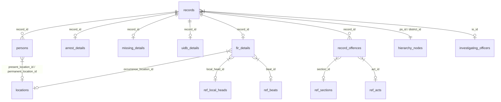

# PHAROS Daily Diary: Report Columns to Database Mapping Specification

This document provides the complete, authoritative reference for how all **20 worksheets** of the **Daily Diary Excel Report** map to the underlying PostgreSQL database tables, columns, relations, and formatting functions.

---

## 1. Core Data Models & Join Architecture

The reporting engine loads records via optimized bulk queries across the primary schema tables and joins:

### Primary Table Aliases & Roles:
* `r` $\rightarrow$ `records` (Core record envelope: `id`, `record_type`, `record_date`, `registration_date`, `ps_id`, `district_id`, `io_id`, `current_status`)
* `fd` $\rightarrow$ `fir_details` (CASE details: `fir_no`, `original_fir_no`, `fir_date`, `gd_no`, `gd_date`, `case_type`, `case_status`, `disposal_type`, `rc_no`, `brief_facts`, `occurrence_from_datetime`, `cd_uploaded_24h`, `footage_collected`, `extra`)
* `ad` $\rightarrow$ `arrest_details` (ARREST details: `arrest_date`, `arrest_time`, `is_dd_based`, `scheme_of_arrest`, `recovery`, `seizure_desc`, `previous_involvement`, `is_bad_character`, `is_proclaimed_offender`)
* `md` $\rightarrow$ `missing_details` (MISSING details: `missing_type`, `missing_status`, `operator_name`, `extra`)
* `ud` $\rightarrow$ `uidb_details` (UIDB details: `uidb_no`, `found_date`, `inquest_sections`, `cause_of_death`, `inquest_status`, `filed_by_acp_sdm`, `filed_by_acp_sdm_date`)
* `p` $\rightarrow$ `persons` (Associated entities: `role` = `COMPLAINANT`, `ARRESTEE`, `VICTIM`, `DECEASED`, `MISSING`, `FOUND`)
* `occ` / `floc` / `pl` $\rightarrow$ `locations` (Occurrence, found location, and person address entities)
* `io` $\rightarrow$ `investigating_officers` (`rank`, `name`, `pis_no`, `mobile`)
* `ps` / `dist` $\rightarrow$ `hierarchy_nodes` (Police station name, district name)
* `s` / `a` $\rightarrow$ `ref.sections` & `ref.acts` (Statutory section and act names)

---

## 2. Common Data Transformation Helpers

1. **Date Formatting (`fmtD`)**:
   `toDMY(date)` $\rightarrow$ Formats date strings to `DD/MM/YYYY`.
2. **DateTime Formatting (`fmtDT`)**:
   Formats ISO timestamp to `DD/MM/YYYY HH:MM`.
3. **Person Composite Formatting (`fmtP`)**:
   `[Name] [@Alias] / [RelationType] [RelativeName] / Age: [Age] / [Present Address]`
4. **Physical Description (`fmtBody`)**:
   `Ht: [Height] / Built: [Built] / Comp: [Complexion] / Hair: [Hair] / Dress: [Dress]`
5. **Investigating Officer (`fmtIO`)**:
   `[Rank] [Name] / [PIS No.]`
6. **Under Section Formatter (`getUS`)**:
   Aggregates `record_offences` into a single string: `[Act Long] u/s [Section 1], [Section 2]`
7. **Custody Status Formatter (`fmtCust`)**:
   Translates status codes (`JC` $\rightarrow$ Judicial Custody, `PC` $\rightarrow$ Police Custody, `Bail`, `Bound Down`, `Release`, `Lockup`, `35(3) BNS Notice`, `Apprehension`).
8. **Criminal History Formatter (`hist`)**:
   Compiles active flags: `PI` (Previous Involvement), `PO` (Proclaimed Offender), `BC` (Bad Character).

---

## 3. Detailed Worksheet Mappings (Sheets 1 – 20)

---

### Sheet 1: `1. Manual FIR`
* **Filter Scope:** `r.record_type = 'CASE'` AND (`fd.case_type = 'cctns(manual FIR)'` OR `registration_type = 'manual'`).

| Col # | Column Header | Database Field Source | Formatting / Transformation Logic |
| :---: | :--- | :--- | :--- |
| **A** | `S. No.` | Row counter | Auto-incrementing 1-based index |
| **B** | `FIR Date` | `COALESCE(fd.fir_date, r.registration_date, r.record_date)` | `fmtD(date)` $\rightarrow$ `DD/MM/YYYY` |
| **C** | `Police Station` | `ps.name` | Police Station name string |
| **D** | `FIR No.` | `COALESCE(fd.original_fir_no, fd.fir_no, fd.gd_no)` | Full 14-digit statutory FIR No. |
| **E** | `U/S` | `record_offences` $\rightarrow$ `ref.sections` + `ref.acts` | `getUS(r.id)` |
| **F** | `Complainant` | `persons (role = 'COMPLAINANT')` + `locations` | `fmtP(PR[r.id]?.COMPLAINANT)` |
| **G** | `Date & Time of Occurrence` | `fd.occurrence_from_datetime` | `fmtDT(datetime)` $\rightarrow$ `DD/MM/YYYY HH:MM` |
| **H** | `Place of Occurrence` | `locations (occ.*)` | `fmtLoc(r, 'occ')` (House, Street, Colony, Village, Tehsil, District) |
| **I** | `Brief Facts` | `fd.brief_facts` | Raw text narrative |
| **J** | `Arrested Person` | `persons (role = 'ARRESTEE')` + `locations` | `fmtP(PR[r.id]?.ARRESTEE)` |
| **K** | `Name of IO` | `investigating_officers (io.*)` | `fmtIO(r)` $\rightarrow$ `[Rank] [Name] / [PIS]` |

---

### Sheet 2: `2. E-Burglary Cases`
* **Filter Scope:** `r.record_type = 'CASE'` AND (`fd.case_type = 'eTheft'` OR `lh.local_head ILIKE '%burglary%'`).

| Col # | Column Header | Database Field Source | Formatting / Transformation Logic |
| :---: | :--- | :--- | :--- |
| **A** | `S. No.` | Row counter | 1-based index |
| **B** | `FIR Date` | `COALESCE(fd.fir_date, r.registration_date)` | `fmtD(date)` |
| **C** | `Police Station` | `ps.name` | Police Station name |
| **D** | `FIR No.` | `COALESCE(fd.original_fir_no, fd.fir_no)` | FIR Number |
| **E** | `Beat` | `ref.beats (bt.beat_name, bt.beat_cd)` | `[Beat Name] ([Beat Code])` |
| **F** | `U/S` | `record_offences` | `getUS(r.id)` |
| **G** | `Complainant` | `persons (role = 'COMPLAINANT')` | `fmtP(PR[r.id]?.COMPLAINANT)` |
| **H** | `Date & Time of Occurrence` | `fd.occurrence_from_datetime` | `fmtDT(datetime)` |
| **I** | `Place of Occurrence` | `locations (occ.*)` | `fmtLoc(r, 'occ')` |
| **J** | `Stolen Property` | `fd.extra -> stolen_property` | Stolen property category & value summary |
| **K** | `Name of IO` | `investigating_officers` | `fmtIO(r)` |

---

### Sheet 3: `3. E-House Theft Cases`
* **Filter Scope:** `r.record_type = 'CASE'` AND `lh.local_head ILIKE '%house theft%'`.

| Col # | Column Header | Database Field Source | Formatting / Transformation Logic |
| :---: | :--- | :--- | :--- |
| **A** | `S. No.` | Row counter | 1-based index |
| **B** | `FIR Date` | `COALESCE(fd.fir_date, r.registration_date)` | `fmtD(date)` |
| **C** | `Police Station` | `ps.name` | Police Station name |
| **D** | `FIR No.` | `COALESCE(fd.original_fir_no, fd.fir_no)` | FIR Number |
| **E** | `Beat` | `ref.beats` | `bt.beat_name` |
| **F** | `U/S` | `record_offences` | `getUS(r.id)` |
| **G** | `Complainant` | `persons (role = 'COMPLAINANT')` | `fmtP(PR[r.id]?.COMPLAINANT)` |
| **H** | `Place of Occurrence` | `locations (occ.*)` | `fmtLoc(r, 'occ')` *(Note: Place precedes DateTime)* |
| **I** | `Date & Time of Occurrence` | `fd.occurrence_from_datetime` | `fmtDT(datetime)` |
| **J** | `Stolen Property` | `fd.extra -> stolen_property` | Description & Estimated Value (₹) |
| **K** | `Name of IO` | `investigating_officers` | `fmtIO(r)` |

---

### Sheet 4: `4. E-Other Theft Cases`
* **Filter Scope:** `r.record_type = 'CASE'` AND `fd.case_type = 'eTheft'` (excluding Burglary and House Theft).

| Col # | Column Header | Database Field Source | Formatting / Transformation Logic |
| :---: | :--- | :--- | :--- |
| **A** | `S. No.` | Row counter | 1-based index |
| **B** | `FIR Date` | `COALESCE(fd.fir_date, r.registration_date)` | `fmtD(date)` |
| **C** | `Police Station` | `ps.name` | Police Station name |
| **D** | `FIR No.` | `COALESCE(fd.original_fir_no, fd.fir_no)` | FIR Number |
| **E** | `Beat` | `ref.beats` | `bt.beat_name` |
| **F** | `U/S` | `record_offences` | `getUS(r.id)` |
| **G** | `Complainant` | `persons (role = 'COMPLAINANT')` | `fmtP(PR[r.id]?.COMPLAINANT)` |
| **H** | `Place of Occurrence` | `locations (occ.*)` | `fmtLoc(r, 'occ')` |
| **I** | `Date & Time of Occurrence` | `fd.occurrence_from_datetime` | `fmtDT(datetime)` |
| **J** | `Stolen Property` | `fd.extra -> stolen_property` | Stolen articles breakdown |
| **K** | `Name of IO` | `investigating_officers` | `fmtIO(r)` |

---

### Sheet 5: `5. MVT Cases` (Motor Vehicle Theft)
* **Filter Scope:** `r.record_type = 'CASE'` AND (`fd.case_type = 'eMVT'` OR `lh.local_head ILIKE '%motor vehicle%'` OR `lh.local_head ILIKE '%m.v.%'`).

| Col # | Column Header | Database Field Source | Formatting / Transformation Logic |
| :---: | :--- | :--- | :--- |
| **A** | `S. No.` | Row counter | 1-based index |
| **B** | `FIR Date` | `COALESCE(fd.fir_date, r.registration_date)` | `fmtD(date)` |
| **C** | `Police Station` | `ps.name` | Police Station name |
| **D** | `FIR No.` | `COALESCE(fd.original_fir_no, fd.fir_no)` | FIR Number |
| **E** | `Beat` | `ref.beats` | `bt.beat_name` |
| **F** | `U/S` | `record_offences` | `getUS(r.id)` |
| **G** | `Complainant` | `persons (role = 'COMPLAINANT')` | `fmtP(PR[r.id]?.COMPLAINANT)` |
| **H** | `Date & Time of Occurrence` | `fd.occurrence_from_datetime` | `fmtDT(datetime)` |
| **I** | `Place of Occurrence` | `locations (occ.*)` | `fmtLoc(r, 'occ')` |
| **J** | `Vehicle Details` | `fd.extra -> vehicle_no / vehicle_type` | `[Vehicle Type] - Reg: [Vehicle No.]` |
| **K** | `1st CD Uploaded within 24 Hours` | `fd.cd_uploaded_24h` | `Yes` / `No` |
| **L** | `CCTV Footage Collected` | `fd.footage_collected` | `Yes` / `No` |
| **M** | `Name of IO` | `investigating_officers` | `fmtIO(r)` |

---

### Sheet 6: `6. Arrested - Kalandara Preven`
* **Filter Scope:** `r.record_type = 'ARREST'` AND (`ad.is_dd_based = true` OR `ad.case_type = 'kalandra'`).

| Col # | Column Header | Database Field Source | Formatting / Transformation Logic |
| :---: | :--- | :--- | :--- |
| **A** | `FIR / DD No.` | `COALESCE(ad.gd_no, r.record_uid)` | GD Number / DD Entry |
| **B** | `Police Station` | `ps.name` | Police Station name |
| **C** | `U/S` | `record_offences` | `getUS(r.id)` (e.g. 126/170 BNSS / 107/151 CrPC) |
| **D** | `Accused` | `persons (role = 'ARRESTEE')` + `locations` | `fmtP(PR[r.id]?.ARRESTEE)` |
| **E** | `Name of IO` | `investigating_officers` | `fmtIO(r)` |
| **F** | `IO Mobile` | `io.mobile` | Mobile Number string |
| **G** | `Custody Status` | `persons.status` / `ad.custody_status` | `fmtCust(status)` (JC / PC / Bail / Bound Down / Release) |
| **H** | `Accused History` | `ad.previous_involvement, ad.is_bad_character, ad.is_proclaimed_offender` | `hist(r)` $\rightarrow$ `PI / BC / PO` |
| **I** | `Recovery` | `ad.recovery` / `ad.seizure_desc` | Seized weapons/illicit items |
| **J** | `Arrest Scheme` | `ad.scheme_of_arrest` | `resolveArrestScheme(r)` (Integrated Pride, Group Patrolling, etc.) |

---

### Sheet 7: `7. Arrested - E-FIR Theft`
* **Filter Scope:** `r.record_type = 'ARREST'` linked to E-Theft cases (`ad.case_type = 'eTheft'` OR `lh.local_head ILIKE '%theft%'`).

| Col # | Column Header | Database Field Source | Formatting / Transformation Logic |
| :---: | :--- | :--- | :--- |
| **A** | `FIR No.` | `COALESCE(ad.fir_no, ad.gd_no)` | FIR Number |
| **B** | `U/S` | `record_offences` | `getUS(r.id)` |
| **C** | `Accused` | `persons (role = 'ARRESTEE')` | `fmtP(PR[r.id]?.ARRESTEE)` |
| **D** | `Name of IO` | `investigating_officers` | `fmtIO(r)` |
| **E** | `Custody Status` | `persons.status` / `ad.custody_status` | `fmtCust(status)` |
| **F** | `Accused History` | `ad.*` flags | `hist(r)` |
| **G** | `Recovery` | `ad.recovery` | Recovered property description |
| **H** | `Arrest Scheme` | `ad.scheme_of_arrest` | `resolveArrestScheme(r)` |

---

### Sheet 8: `Arrested - District` (Master District Arrest Log)
* **Filter Scope:** All `r.record_type = 'ARREST'` within district scope.

| Col # | Column Header | Database Field Source | Formatting / Transformation Logic |
| :---: | :--- | :--- | :--- |
| **A** | `S. No.` | Row counter | 1-based index |
| **B** | `FIR / DD No.` | `COALESCE(ad.fir_no, ad.gd_no)` | FIR / DD Number |
| **C** | `Police Station` | `ps.name` | Police Station name |
| **D** | `U/S` | `record_offences` | `getUS(r.id)` |
| **E** | `Accused` | `persons (role = 'ARRESTEE')` | `fmtP(PR[r.id]?.ARRESTEE)` |
| **F** | `Name of IO` | `investigating_officers` | `fmtIO(r)` |
| **G** | `Custody Status` | `persons.status` / `ad.custody_status` | `fmtCust(status)` |
| **H** | `Accused History` | `ad.*` flags | `hist(r)` |
| **I** | `Recovery` | `ad.recovery` | Recovery details |
| **J** | `Arrest Scheme` | `ad.scheme_of_arrest` | `resolveArrestScheme(r)` |

---

### Sheet 9: `8. Arrested - E-FIR MV Theft`
* **Filter Scope:** `r.record_type = 'ARREST'` linked to Motor Vehicle Theft (`ad.case_type = 'eMVT'` OR `lh.local_head ILIKE '%motor vehicle%'`).

| Col # | Column Header | Database Field Source | Formatting / Transformation Logic |
| :---: | :--- | :--- | :--- |
| **A** | `FIR No.` | `COALESCE(ad.fir_no, ad.gd_no)` | FIR Number |
| **B** | `U/S` | `record_offences` | `getUS(r.id)` |
| **C** | `Accused` | `persons (role = 'ARRESTEE')` | `fmtP(PR[r.id]?.ARRESTEE)` |
| **D** | `Name of IO` | `investigating_officers` | `fmtIO(r)` |
| **E** | `Custody Status` | `persons.status` / `ad.custody_status` | `fmtCust(status)` |
| **F** | `Accused History` | `ad.*` flags | `hist(r)` |
| **G** | `Recovery` | `ad.recovery` | Recovered vehicle details |
| **H** | `Arrest Scheme` | `ad.scheme_of_arrest` | `resolveArrestScheme(r)` |

---

### Sheet 10: `11. Arrested - Last 24 Hrs`
* **Filter Scope:** `r.record_type = 'ARREST'` registered within the 24-hour reporting window.

| Col # | Column Header | Database Field Source | Formatting / Transformation Logic |
| :---: | :--- | :--- | :--- |
| **A** | `S. No.` | Row counter | 1-based index |
| **B** | `Accused` | `persons (role = 'ARRESTEE')` | `fmtP(PR[r.id]?.ARRESTEE)` |
| **C** | `FIR / DD No.` | `COALESCE(ad.fir_no, ad.gd_no)` | FIR / DD Number |
| **D** | `U/S` | `record_offences` | `getUS(r.id)` |
| **E** | `Police Station` | `ps.name` | Police Station name |
| **F** | `Name of IO` | `investigating_officers` | `fmtIO(r)` |
| **G** | `IO Mobile` | `io.mobile` | Mobile Number string |
| **H** | `Status of arrest` | `persons.status` / `ad.custody_status` | `fmtCust(status)` |

---

### Sheets 11, 12, 13: `PI Disposal` (Manual, E-Theft, E-MVT)
* **Filter Scope:** `r.record_type = 'CASE'` AND `fd.disposal_type IS NOT NULL` filtered by case category:
  * **Sheet 11 (`12. PI Disposal-Manual`):** Manual FIRs
  * **Sheet 12 (`13. PI Disposal-E-Theft`):** E-Theft cases
  * **Sheet 13 (`14. PI Disposal-E-MVT`):** E-MVT cases

| Col # | Column Header | Database Field Source | Formatting / Transformation Logic |
| :---: | :--- | :--- | :--- |
| **A** | `S. No.` | Row counter | 1-based index |
| **B** | `FIR No.` | `COALESCE(fd.original_fir_no, fd.fir_no)` | FIR Number |
| **C** | `FIR Date` | `COALESCE(fd.fir_date, r.registration_date)` | `fmtD(date)` |
| **D** | `U/S` | `record_offences` | `getUS(r.id)` |
| **E** | `RC No.` | `fd.rc_no` | Road Certificate / Disposal dispatch number |
| **F** | `Disposal` | `fd.disposal_type` | `Challan` / `Untraced` / `Cancelled` |

---

### Sheet 14: `15. Missing Persons`
* **Filter Scope:** `r.record_type = 'MISSING'` AND (`md.missing_type = 'Missing'` OR `md.missing_status = 'MISSING'`).

| Col # | Column Header | Database Field Source | Formatting / Transformation Logic |
| :---: | :--- | :--- | :--- |
| **A** | `S.No.` | Row counter | 1-based index |
| **B** | `DD No.` | `COALESCE(md.gd_no, r.record_uid)` | Daily Diary Entry Number |
| **C** | `DD Date` | `COALESCE(md.gd_date, r.record_date)` | `fmtD(date)` |
| **D** | `Operator (MPS)` | `md.operator_name` | Missing Persons Squad Operator |
| **E** | `Name of Missing Person` | `persons (role = 'MISSING')` | `p.name` |
| **F** | `Address` | `locations (pl.*)` | Full residence address |
| **G** | `Missing Date` | `COALESCE(md.missing_date, md.gd_date)` | `fmtD(date)` |
| **H** | `Age` | `persons.age` | Age in years |
| **I** | `Body Description` | `persons.extra` | `fmtBody(mp)` (Height, Complexion, Dress, etc.) |
| **J** | `Name of IO` | `investigating_officers` | `fmtIO(r)` |

---

### Sheet 15: `16. UIDB (Unidentified Bodies)`
* **Filter Scope:** `r.record_type = 'UIDB'`.

| Col # | Column Header | Database Field Source | Formatting / Transformation Logic |
| :---: | :--- | :--- | :--- |
| **A** | `S.No.` | Row counter | 1-based index |
| **B** | `DD No.` | `COALESCE(ud.uidb_no, ud.gd_no, r.record_uid)` | UIDB Number / DD No. |
| **C** | `DD Date` | `COALESCE(ud.gd_date, r.record_date)` | `fmtD(date)` |
| **D** | `Found Place` | `locations (floc.*)` | Full place description where body was found |
| **E** | `Found Date` | `ud.found_date` | `fmtD(date)` |
| **F** | `Sex` | `persons (role = 'DECEASED')` $\rightarrow$ `gender` | `Male` / `Female` / `Other` |
| **G** | `Age` | `persons.age` | Estimated Age |
| **H** | `Body Description` | `persons.extra` | `fmtBody(dec)` (Physical marks, clothing) |
| **I** | `Name of IO` | `investigating_officers` | `fmtIO(r)` |

---

### Sheet 16: `17. Abandoned Persons`
* **Filter Scope:** `r.record_type = 'MISSING'` AND `md.missing_type ILIKE '%abandon%'` OR `md.missing_type ILIKE '%found%'`.

| Col # | Column Header | Database Field Source | Formatting / Transformation Logic |
| :---: | :--- | :--- | :--- |
| **A** | `S.No.` | Row counter | 1-based index |
| **B** | `DD No.` | `COALESCE(md.gd_no, r.record_uid)` | DD Number |
| **C** | `Found Place` | `persons (role = 'FOUND')` $\rightarrow$ address | Place recovered/found |
| **D** | `Found Date` | `COALESCE(md.gd_date, r.record_date)` | `fmtD(date)` |
| **E** | `Sex` | `persons.gender` | Gender |
| **F** | `Age` | `persons.age` | Age |
| **G** | `Body Description` | `persons.extra` | `fmtBody(mp)` |
| **H** | `Name of IO` | `investigating_officers` | `fmtIO(r)` |

---

### Sheet 17: `18. Traced Persons`
* **Filter Scope:** `r.record_type = 'MISSING'` AND `md.missing_status = 'TRACED'`.

| Col # | Column Header | Database Field Source | Formatting / Transformation Logic |
| :---: | :--- | :--- | :--- |
| **A** | `S.No.` | Row counter | 1-based index |
| **B** | `DD No.` | `COALESCE(md.gd_no, r.record_uid)` | DD Number |
| **C** | `DD Date` | `COALESCE(md.gd_date, r.record_date)` | `fmtD(date)` |
| **D** | `Operator (MPS)` | `md.operator_name` | MPS Operator Name |
| **E** | `Traced Person Details` | `persons (role = 'MISSING')` + `locations` | `fmtP(mp)` (Name, Parentage, Full Address) |
| **F** | `Name of IO` | `investigating_officers` | `fmtIO(r)` |

---

### Sheet 18: `19. Inquest Registered`
* **Filter Scope:** `r.record_type = 'UIDB'` AND (`ud.inquest_status IS NOT NULL` OR `ud.inquest_sections IS NOT NULL`).

| Col # | Column Header | Database Field Source | Formatting / Transformation Logic |
| :---: | :--- | :--- | :--- |
| **A** | `S.N.` | Row counter | 1-based index |
| **B** | `DD No.` | `COALESCE(ud.uidb_no, ud.gd_no)` | DD Number |
| **C** | `DD Date` | `COALESCE(ud.gd_date, r.record_date)` | `fmtD(date)` |
| **D** | `U/S` | `ud.inquest_sections` | Section 194 BNSS / 174 CrPC |
| **E** | `Deceased` | `persons (role = 'DECEASED')` + `locations` | `fmtP(dec)` |
| **F** | `Sex` | `persons.gender` | Gender |
| **G** | `Cause of Death` | `ud.cause_of_death` / `ud.cause_of_death_other` | Cause of death description |
| **H** | `Place of Occurrence` | `locations (floc.*)` | `fmtLoc(r, 'floc')` |
| **I** | `Name of IO` | `investigating_officers` | `fmtIO(r)` |

---

### Sheet 19: `20. Inquest ACPSDM Disposal`
* **Filter Scope:** `r.record_type = 'UIDB'` AND `ud.filed_by_acp_sdm = true`.

| Col # | Column Header | Database Field Source | Formatting / Transformation Logic |
| :---: | :--- | :--- | :--- |
| **A** | `S.N.` | Row counter | 1-based index |
| **B** | `DD No.` | `COALESCE(ud.uidb_no, ud.gd_no)` | DD Number |
| **C** | `DD Date` | `COALESCE(ud.gd_date, r.record_date)` | `fmtD(date)` |
| **D** | `Deceased` | `persons (role = 'DECEASED')` | `fmtP(dec)` |
| **E** | `Disposal Date (ACP/SDM)` | `ud.filed_by_acp_sdm_date` | `fmtD(date)` |
| **F** | `Cause of Death` | `ud.cause_of_death` | Cause of death |
| **G** | `Place of Occurrence` | `locations (floc.*)` | `fmtLoc(r, 'floc')` |
| **H** | `Name of IO` | `investigating_officers` | `fmtIO(r)` |

---

### Sheet 20: `21. FIR Goswara Summary`
* **Aggregation Method:** Multi-dimensional matrix grouped by `ps.name`.

| Col # | Column Header | Aggregation Formula & Source |
| :---: | :--- | :--- |
| **A** | `Police Station` | `ps.name` |
| **B** | `Manual FIR Arrests` | `COUNT(arrRows where case_type = 'cctns(manual FIR)' AND r.ps_id = ps.id)` |
| **C** | `E-Theft Arrests` | `COUNT(arrRows where case_type = 'eTheft' AND r.ps_id = ps.id)` |
| **D** | `House Theft Arrests` | `COUNT(arrRows where crime_head ILIKE '%house theft%' AND r.ps_id = ps.id)` |
| **E** | `Burglary Arrests` | `COUNT(arrRows where crime_head ILIKE '%burglary%' AND r.ps_id = ps.id)` |
| **F** | `E-MVT Arrests` | `COUNT(arrRows where case_type = 'eMVT' AND r.ps_id = ps.id)` |
| **G** | `Total Arrests` | `=SUM(B_row:F_row)` (Excel Formula Sum) |

---

## 4. Summary Table of Column Counts & DB Entities

| Sheet # | Sheet Key / Name | Total Columns | Primary DB Table | Filter Predicate |
| :---: | :--- | :---: | :--- | :--- |
| **1** | `1. Manual FIR` | 11 | `fir_details` | `case_type = 'cctns(manual FIR)'` |
| **2** | `2. E-Burglary Cases` | 11 | `fir_details` | `case_type = 'eTheft' AND crime_head ~ 'burglary'` |
| **3** | `3. E-House Theft Cases` | 11 | `fir_details` | `crime_head ~ 'house theft'` |
| **4** | `4. E-Other Theft Cases` | 11 | `fir_details` | `case_type = 'eTheft' (other)` |
| **5** | `5. MVT Cases` | 13 | `fir_details` | `case_type = 'eMVT' OR crime_head ~ 'm.v.'` |
| **6** | `6. Arrested-Kalandara Preven` | 10 | `arrest_details` | `is_dd_based = true` |
| **7** | `7. Arrested-E-FIR Theft` | 8 | `arrest_details` | `case_type = 'eTheft'` |
| **8** | `Arrested-District` | 10 | `arrest_details` | All arrests in District scope |
| **9** | `8. Arrested-E-FIR MV Theft` | 8 | `arrest_details` | `case_type = 'eMVT'` |
| **10** | `11. Arrested-Last 24 Hrs` | 8 | `arrest_details` | Arrests in last 24h window |
| **11** | `12. PI Disposal-Manual` | 6 | `fir_details` | `disposal_type IS NOT NULL AND manual` |
| **12** | `13. PI Disposal-E-Theft` | 6 | `fir_details` | `disposal_type IS NOT NULL AND eTheft` |
| **13** | `14. PI Disposal-E-MVT` | 6 | `fir_details` | `disposal_type IS NOT NULL AND eMVT` |
| **14** | `15. Missing Persons` | 10 | `missing_details` | `missing_status = 'MISSING'` |
| **15** | `16. UIDB (Unidentified Bodies)` | 9 | `uidb_details` | `record_type = 'UIDB'` |
| **16** | `17. Abandoned Persons` | 8 | `missing_details` | `missing_type ~ 'abandon'` |
| **17** | `18. Traced Persons` | 6 | `missing_details` | `missing_status = 'TRACED'` |
| **18** | `19. Inquest Registered` | 9 | `uidb_details` | `inquest_status / sections IS NOT NULL` |
| **19** | `20. Inquest ACPSDM Disposal` | 8 | `uidb_details` | `filed_by_acp_sdm = true` |
| **20** | `21. FIR Goswara Summary` | 7 | Cross-entity | Grouped by `police_stations` |
