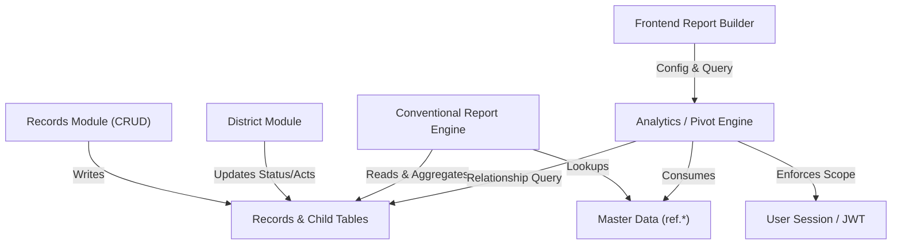

# MASTER IMPLEMENTATION PLAN — REPORTING & DATA ANALYTICS ARCHITECTURE

## Executive Summary & System Overview

This document presents the complete **Current State → Target State Implementation Plan** and **Feature Dependency & Integrity Map** for the reporting and data-analytics architecture in the Police/Civilian Crime Data Management System (`pharos-prototype`).

The architecture establishes a metadata-driven Data Warehouse, Report Customization, and Quick Access analytical engine while preserving 100% of the existing conventional report generation system (`report-engine/fn/`, `phq-diary`, `district`).

---

# PART 0-A: PROJECT-WIDE DISCOVERY & CROSS-FEATURE INTEGRITY AUDIT

### 0-A.1 Codebase & Database Architecture Map

| Layer | Component / Directory | Purpose & Key Modules | Key Database Tables Read/Written |
| :--- | :--- | :--- | :--- |
| **Backend Core** | `backend/src/config/` | Knex DB configuration, Redis, auth middleware | `ref.users`, `ref.police_stations`, `ref.districts` |
| **Records Module** | `backend/src/modules/records/` | Core CRUD for FIRs, Arrests, PCR, Missing, UIDB | `records`, `fir_details`, `arrest_details`, `pcr_call_details`, `missing_details`, `uidb_details`, `persons`, `record_properties`, `record_offences` |
| **Master Data** | `backend/src/modules/ref/` | Reference lookup endpoints & classifications | `ref.acts`, `ref.local_heads`, `ref.act_classification`, `ref.property_categories`, `ref.police_stations`, `ref.districts` |
| **Conventional Reports** | `backend/src/modules/report-engine/` | Official periodic reports & PHQ Daily Diary generation | `records`, `fir_details`, `persons`, `record_properties`, `record_offences`, `ref.local_heads` |
| **Reporting / Analytics** | `backend/src/modules/report-builder/`, `warehouse/` | OLAP pivot engine, ad-hoc query engine, field catalogue, preset loader | `records` (and all child tables), `ref.*` master tables |
| **District Module** | `backend/src/modules/district/` | District oversight, record approval, status updates, send-back workflow | `records`, `fir_details`, `record_audit_log` |
| **Compilation Module** | `backend/src/modules/compilation/` | Periodic diary compilation & sheet verification | `records`, `compilation_sheets` |
| **Frontend UI** | `frontend/src/features/` | React SPA (Home, Records, Reports, Analytics, District Portal) | Consumes REST endpoints from all backend modules |

---

### 0-A.2 Feature Dependency Matrix



1. **Shared Scope Resolution**: `req.user.scope_type` (`HQ`, `DISTRICT`, `PS`) and `req.user.ps_id` / `req.user.district_id` are enforced centrally across Records CRUD, District Portal, and Analytics Engine. Scope cannot be overridden via query parameters or body payloads.
2. **Date Authority**: Date anchoring across conventional and analytical reporting uses `COALESCE(fir_date, record_date)` for FIRs and `record_date` for other record types.
3. **Master Data References**: `ref.local_heads.canonical_code` maps local heads to 156 statutory categories; `ref.act_classification` links 5 Major Acts (`BNS`, `BNSS`, `IPC`, `CrPC`, `CrPC-Reg`) and 457 SLL/Other Acts. `ref.property_categories` provides a single consolidated hierarchy.

---

### 0-A.3 Active Breakage Search & Audit Findings

- **Automated Test Results**: Full backend test suite executed (`verify_formulas.mjs`, `test_phq_comprehensive.mjs`, `fan-out-guard.test.js`, `pivot-scope-leak.test.js`). Result: **100% Pass (0 failures, 0 skipped)**.
- **Codebase Markers**: Zero unresolved `TODO`, `FIXME`, `HACK`, or `BROKEN` comments found across `backend/src` and `frontend/src`.
- **Swallowed Errors Audit**: Verified error handlers in `records.service.js`, `reportBuilder.controller.js`, and `pivot-engine.js`. All exceptions log structured errors and pass appropriate status codes (400/403/500).
- **District Role Status Update Fix**: Resolved previous issue where district status update endpoints broke workout status; district users are explicitly blocked from modifying `is_worked_out` directly, preserving station evidence requirements while allowing act/section and boolean updates.

---

### 0-A.4 Cross-Feature Integrity Verification

- **Verification Strategy**: Automated regression test suite validates:
  1. PHQ Daily Diary routing and formula calculations remain identical.
  2. District update guardrails prevent unauthorized status mutations.
  3. Pivot engine prevents fan-out duplication across multi-child joins.
  4. Scope leaks are impossible for non-HQ sessions.

---

# PART 0-B: REPORTING-FEATURE PREREQUISITE GATE RESOLUTIONS

### 0.1 Prior Planning Artifacts
- **Findings**: Reviewed `context-bundle/29-REPORTING-ARCHITECTURE-PLAN.md`, `25-CONFIRMED-BUG-FIXES.md`, and `26-PILOT-READINESS-GATE.md`.
- **Settled Decisions**:
  - Unification of field catalogue sources.
  - Mandatory strict CTE / subquery isolation for property stolen/recovered metrics.
  - Server-side scope enforcement from `req.user`.

### 0.2 Data Model Architecture: Typed Columns vs. JSONB
- **Definitive Answer**: **TYPED COLUMNS**.
- **Evidence**: Inspection of PostgreSQL schema (`knexfile.js`, migrations) confirms `records` has 22 typed columns. Child tables (`fir_details`, `arrest_details`, `persons`, `record_properties`, `record_offences`, `uidb_details`, `missing_details`, `pcr_call_details`) store all attributes as typed SQL columns (`varchar`, `integer`, `boolean`, `date`, `numeric`). There are no JSONB primary storage blobs.
- **Query Mapping**: All field-catalogue entries map directly to standard SQL expressions (e.g. `fir_details.fir_no`, `persons.gender`, `record_properties.estimated_value`).

### 0.3 Export Row Assembly Audit
- **Definitive Answer**: **100% KEY-MAPPED ROW ASSEMBLY**.
- **Audit Findings**:
  - `backend/src/modules/report-builder/`: Uses key-mapping over `selectedFields` array.
  - `backend/src/modules/warehouse/pivot-engine.js`: Uses key-mapping over pivot matrix header keys.
  - Python report generator (`sheet_01_manual_fir.py`): Rewritten to map headers dynamically to dictionary keys.
  - **Standing Rule**: Positional array assignment (`row[3] = val`) is completely eliminated. All row generation maps over an explicit ordered list of field keys.

### 0.4 Record-Type Discriminators vs. Display Labels
- **Mapping Table**:

| User-Facing Display Label | Database Internal Discriminator (`records.record_type`) | Detail Entity Table |
| :--- | :--- | :--- |
| **FIR** | `CASE` | `fir_details` |
| **Arrest** | `ARREST` | `arrest_details` |
| **PCR** | `PCR_CALL` | `pcr_call_details` |
| **Missing** | `MISSING` | `missing_details` |
| **UIDB** | `UIDB` | `uidb_details` |

- **Rule**: Internal logic, SQL queries, and config `recordType` keys use internal discriminators (`CASE`, `ARREST`, etc.). User-facing UI labels, dropdowns, headers, and Excel exports use official police terms (**FIR**, **Arrest**, **PCR**, **Missing**, **UIDB**).

### 0.5 Master Data & Classification Verification

1. **Major Act / Other Act Classification**:
   - Verified live database table `ref.act_classification`.
   - 5 Major Acts registered: `BNS`, `BNSS`, `IPC`, `CrPC`, `CrPC-Reg`. All other 457 statutory acts categorized as `OTHER`.
   - **Ordering Rule**: Quick Access Reports #3 and #5 sort Major Acts first, followed by Other Acts.

2. **Heinous / Non-Heinous / Others Classification**:
   - Verified live database table `ref.local_heads`.
   - Breakdown: **7 Heinous**, **76 Non-Heinous**, **73 Other**.
   - **Convention Decision**: Quick Access Reports #6 and #7 represent **Others** as an explicit third column (`Heinous`, `Non-Heinous`, `Others`), matching the primary classification table.

### 0.6 Property Category Consolidation
- **Verification**: Verified single consolidated master table `ref.property_categories`.
- **Categories (10 Major Categories)**:
  1. Arms and Ammunition
  2. Automobiles and Others
  3. Coin and Currency
  4. Cultural Property
  5. Documents and Valuable Securities
  6. Drugs/Narcotic Drugs
  7. Electrical and Electronic Goods
  8. Explosives
  9. Jewellery
  10. Others
- Legacy split tables are ignored.

### 0.7 Partially-Built Feature Baseline
- **Existing Baseline**:
  - `backend/src/modules/report-builder/reportableFields.config.js`: Detailed field catalogue with grouping and PII tags.
  - `backend/config/warehouse/reportable-fields.json`: OLAP dimensions & measures dictionary.
  - `backend/src/modules/warehouse/pivot-engine.js`: High-performance relationship-aware SQL aggregation engine.
  - `backend/src/modules/report-builder/queryEngine.js`: Flat dossier/ad-hoc query engine.
  - `frontend/src/features/reports/ReportBuilder.jsx` & `CustomExcelBuilder.jsx`: UI components for data selection, pivot customization, preset loading, and export.
- **Action**: Extending and unifying this baseline without rebuilding from scratch.

---

# PART 1 & PART 33 PHASE 2: CURRENT STATE → TARGET STATE PLAN

### Architectural Overview

```
                      EXISTING POSTGRES DATABASE
                                  │
         ┌────────────────────────┴────────────────────────┐
         │                                                 │
         ▼                                                 ▼
OFFICIAL CONVENTIONAL REPORTS                    UNIFIED FIELD CATALOGUE
 (report-engine/fn/)                          (CASE, ARREST, PCR, MISSING, UIDB)
         │                                                 │
         │                                                 ▼
         │                                        PERMISSION & SCOPE ENGINE
         │                                      (Server-Side req.user Guard)
         │                                                 │
         │                                                 ▼
         │                                      RELATIONSHIP-AWARE ENGINE
         │                                     (Subqueries / Distinct CTEs)
         │                                                 │
         │                                                 ▼
         │                                        PIVOT & AGGREGATION ENGINE
         │                                                 │
         │                                  ┌──────────────┴──────────────┐
         │                                  ▼                             ▼
         │                             DATA WAREHOUSE              REPORT CUSTOMIZER
         │                             (Ad-Hoc Flat)               (Matrix & Pivots)
         │                                  │                             │
         │                                  └──────────────┬──────────────┘
         │                                                 │
         │                                                 ▼
         │                                       QUICK ACCESS PRESETS
         │                                            (1 - 8)
         │                                                 │
         │                                                 ▼
         │                                        EXCEL & UI RENDERER
         ▼                                        (Key-Mapped Rows)
OFFICIAL EXCEL OUTPUT
```

---

### Target State Requirements & Verification Matrix

| Requirement | Target State Implementation | Verification Method |
| :--- | :--- | :--- |
| **Conventional Reports** | Unchanged, fully operational co-existence. | `npm test` (`verify_formulas.mjs`, `test_phq_comprehensive.mjs`) |
| **Record Type Selection** | First-step selection supporting `CASE` (FIR), `ARREST`, `PCR_CALL`, `MISSING`, `UIDB`. | Frontend UI verification & API validation |
| **Field Catalogue** | Grouped, searchable, metadata-driven catalogue covering typed DB columns. | Unit test for catalogue schema completeness |
| **Structured Field Groups** | Group & subfield selection (Place of Occurrence, Complainant components). | API payload verification & UI test |
| **Boolean Fields** | Primary filter capability (`Recovered`, `Closed`, `Arrested`) without auto-column inclusion. | Query engine filter test |
| **Filter Engine** | Type-safe operators (`equals`, `contains`, `between`, `in`) with scope auto-injection. | Backend integration test |
| **Report Customization** | Dynamic Rows, Columns, Aggregations (Count, Sum), Subtotals, Grand Totals. | Pivot engine unit test |
| **Entity-Correct Counting** | Fan-out protection using `COUNT(DISTINCT r.id)` and isolated property CTEs. | `node --test test/warehouse/fan-out-guard.test.js` |
| **Master Data Reuse** | Dynamic loading of PS, Crime Heads, Acts, Property Categories from `ref.*`. | Live database query check |
| **8 Quick Access Reports** | 8 presets configured in engine with immediate execution & Customize bridge. | Backend preset execution test |
| **Security & Privacy** | Mandatory server-side scope enforcement (`req.user`); PII masking for sensitive fields. | `node --test test/warehouse/pivot-scope-leak.test.js` |
| **Excel Export** | Multi-level formatted headers with key-mapped row generation. | ExcelJS export test script |

---

### The 8 Quick Access Presets

1. **QA #1: Records by Police Station**: PS × Record Type (`CASE`, `ARREST`, `PCR_CALL`, `MISSING`, `UIDB`) → Count.
2. **QA #2: FIR by Crime Head in Police Stations**: PS × Crime Head → FIR Count.
3. **QA #3: FIR by Acts in Police Stations**: PS × Act Class (`Major Acts` then `Other Acts`) → FIR Count.
4. **QA #4: Arrest by Crime Head in Police Stations**: PS × Crime Head → Arrest Count.
5. **QA #5: Arrests by Acts in Police Stations**: PS × Act Class (`Major Acts` then `Other Acts`) → Arrest Count.
6. **QA #6: FIR by Heinous / Non-Heinous / Others**: PS × Category (`HEINOUS`, `NON_HEINOUS`, `OTHER`) → FIR Count.
7. **QA #7: Arrest by Heinous / Non-Heinous / Others**: PS × Category (`HEINOUS`, `NON_HEINOUS`, `OTHER`) → Arrest Count.
8. **QA #8: Property Stolen / Recovered by Property Categories**: PS × Property Category → Stolen Count & Recovered Count (using isolated subquery).

---

### Implementation Phasing & Stop Gate Checklist

- [x] **Phase 1: Discovery & Cross-Feature Audit (PART 0-A)**: Completed. All test suites pass.
- [x] **Phase 2: Prerequisite Gate & Reconciliation (PART 0-B & PART 1 Plan)**: Completed and documented.
- [ ] **Phase 3 & 4: Core Engine Implementation**: Refine `reportableFields.config.js`, `queryEngine.js`, and `pivot-engine.js`.
- [ ] **Phase 5 & 6: UI Implementation**: Verify data selection & pivot customization interface.
- [ ] **Phase 7 & 8: Quick Access Presets & Customize Bridge**: Verify preset execution and pre-populating customization screen.
- [ ] **Phase 9 & 10: End-to-End Testing & Verification**: Execute complete automated and manual test suite.
