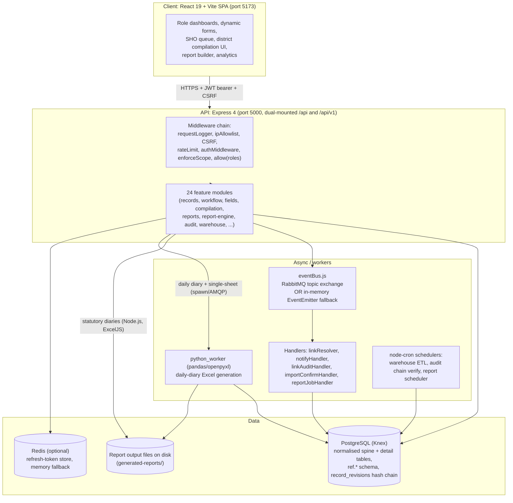
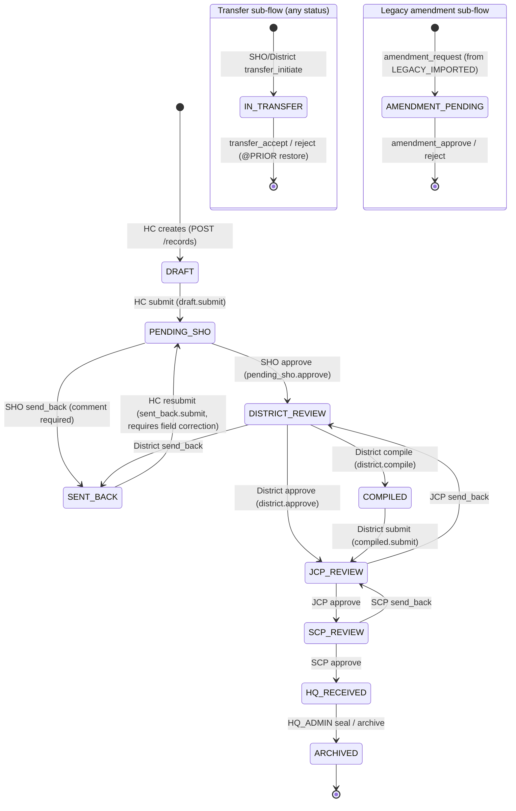
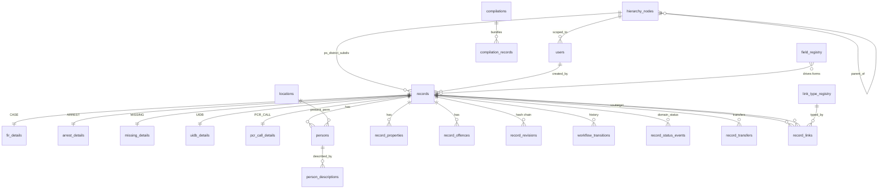

# PHAROS / Crime Diaries (PRISM): Reverse-Engineered Technical Blueprint

**Prepared for:** New engineering team taking ownership of the Crime-Diaries-collab-Vaibhav codebase
**Basis:** Static reverse engineering of the delivered source tree (891 files) plus the supplied specification, decision, and audit documents
**Method:** Code is treated as the source of truth for what is implemented. Supplied documents are treated as the source of intended requirements. Every claim below is tagged with a confidence level, and code/document contradictions are called out explicitly.

**Confidence legend used throughout**

- **[Code]** Confirmed by reading the source.
- **[Doc]** Stated in supplied documentation, not independently confirmed in code.
- **[Inferred]** A reasonable conclusion from patterns, not directly stated.
- **[Unclear]** Cannot be established from the material provided; needs validation.

> One-line orientation: PHAROS is a working, unusually well-instrumented full-stack prototype (React 19 SPA + Express/Knex/PostgreSQL API + a Python Excel worker) for digitising Delhi Police crime diaries and statutory reporting. It is far more complete than "an unstructured buggy codebase" would suggest, but it is a prototype: several subsystems are duplicated or half-migrated, a few config values are wrong for deployment, and the three uploaded architecture specifications describe an older data model that the code has since moved away from.

---

## 1. Executive Summary

PHAROS ("Police Hierarchical Analysis, Reporting and Operations System", also branded Crime Diaries and PRISM) is a jurisdiction-scoped record and reporting platform for Delhi Police. Head Constables enter crime records (FIR cases, arrests, missing persons, unidentified dead bodies, PCR calls); those records move up a multi-tier approval chain (Station House Officer, District, JCP, SCP, Headquarters), and the system compiles statutory Excel diaries (daily, district, and fortnightly) at each level. Every mutation is written to a tamper-evident, hash-chained revision ledger.

**What the reverse engineering established:**

1. The system is a real, substantial implementation: roughly 39,700 lines of backend JavaScript across 24 modules, roughly 36,800 lines of frontend React, a 28-migration PostgreSQL schema of about 43 operational tables plus a 24-table `ref.*` reference schema, and a Python (pandas/openpyxl) worker with 27 statutory sheet generators. It is not a skeleton.

2. The architecture is event-driven and config-driven. Form fields, workflow transitions, and reference data are all data, not code. This is the strongest part of the design and the thing a new team must understand first.

3. The single largest correctness risk is not a bug, it is **stale documentation**. All three uploaded architecture specifications (and the in-repo `DECISIONS.md` sections 3 and 6) describe a `records.data` JSONB "hybrid" store and a Python-centric report engine. The code migrated away from both in a July 2026 restructure. The current schema is fully normalised (one spine table plus typed detail tables), and the statutory diaries are generated in Node.js, not Python. A new team that trusts the specs will build against a data model that no longer exists.

4. There are concrete, evidence-based deployment blockers, chief among them a frontend/backend port mismatch (the SPA and its Vite proxy both target port 3000; the backend listens on 5000) and a hard dependency on external services (PostgreSQL, and optionally RabbitMQ/Redis) plus a Python runtime for a subset of reports.

5. The codebase carries visible prototype debt: two parallel report engines (Node.js and Python) with overlapping scope, a legacy report path that reads a database column that no longer exists, unused dependencies (`mongoose`, `keycloak-connect` unless explicitly enabled), unwired reference components, and a dev-only login backdoor that is safe only because it is gated to `NODE_ENV=development`.

The system can be made deployable. The work is primarily configuration correction, service provisioning, resolving the two-report-engine ambiguity, and reconciling documentation with the normalised schema, rather than a ground-up rebuild.

---

## 2. What This Product Does (plain language)

Delhi Police stations record crime and operational events in registers and diaries: First Information Reports (FIRs), arrest memos, missing-person reports, unidentified dead bodies (UIDB), and PCR (emergency call) logs. Those numbers are then rolled up daily and fortnightly into statutory sheets that districts and headquarters review.

PHAROS digitises that whole chain:

- **Data entry.** A Head Constable opens a dynamic form for the relevant record type and fills it in. The form's fields, dropdowns, validation, and conditional logic are defined in a database registry, not hardcoded, so the form set can change without a code release. **[Code]**
- **Review and correction.** The Station House Officer reviews submitted records, approves them, or sends them back with specific fields flagged for correction. The system refuses re-submission until those exact fields have actually been edited. **[Code]**
- **Escalation.** Approved records climb a chain: District review, JCP, SCP, and finally Headquarters, which seals/archives them. Records can also be transferred between stations and frozen. **[Code]**
- **Auto-linking.** When an arrest or missing report shares an FIR number with a case in the same station, the system links them automatically in the background, in either arrival order. **[Code]**
- **Compilation and statutory reporting.** Districts bundle records into compilations; the platform generates statutory Excel workbooks (daily diary, an 18-sheet district diary, and a 43-sheet fortnightly PHQ diary) with the exact formatting the police proformas require. **[Code]**
- **Integrity.** Every change writes an immutable, hash-chained revision plus an audit log entry. A background job re-verifies the chain and freezes any record whose history looks tampered. **[Code]**
- **Analytics and search.** Dashboards, station performance comparisons, crime-head matrices, a natural-language search, and an ad-hoc report builder sit on top of the same data. **[Code]**

**Who uses it:** Head Constables (entry), Station House Officers (station approval), ACPs (sub-division supervision), District Officers/DCPs (district scrutiny and compilation), JCP and SCP (range/zone review), and Headquarters analysts and admins (statutory reporting, configuration, audit). **[Code]**

---

## 3. Current System Architecture

### 3.1 High-level shape



**[Code]** Every box above was confirmed in source (`backend/src/app.js`, `backend/index.js`, `eventBus.js`, the module tree, `python_worker/`, and the schedulers).

### 3.2 Request lifecycle

A protected API call passes through this chain, in order, from `app.js`:

`requestLoggerMiddleware` (assigns a correlation `requestId` via AsyncLocalStorage) → `ipAllowlistMiddleware` (optional intranet lock, off by default) → `csrfDoubleSubmitMiddleware` → `morgan` → global `apiLimiter` (100/15min in prod) → per-router `authMiddleware` (JWT verify, optional Keycloak fallback) → `roleRateLimitMiddleware` (per-user sliding window) → `enforceScope` (injects `req.jurisdictionQuery`) → `allow(...roles)` (RBAC gate) → controller → service → Knex → PostgreSQL. **[Code]**

Two deliberate exceptions: the client-log ingest route (`/api/logs/client`) is mounted before the security middleware so a logged-out browser can still ship logs, and the auth login/refresh routes are CSRF-exempt because the token is provisioned on that response. **[Code]**

### 3.3 Two entry points (important gotcha)

There are two server bootstraps. `backend/index.js` is the real one (`package.json` `main` and the `dev`/`start` scripts point to it); it connects the DB, runs a startup autoload of config/reference data, connects the event bus, starts all five event handlers, and starts the warehouse and audit schedulers. `backend/src/app.js` also defines a `startServer()` that only runs when `app.js` is executed directly (for example in tests) and wires a smaller handler set. A code comment in `index.js` documents that an earlier version bootstrapped a parallel, now-deleted handler set that never matched, which silently disabled notifications and link resolution in real deployments. That bug is fixed; the lesson for the new team is that `index.js` is authoritative. **[Code]**

---

## 4. Technology Stack

| Layer | Technology | Confidence / notes |
| :--- | :--- | :--- |
| Frontend framework | React 19.2, Vite 8, ES modules | **[Code]** `frontend/package.json`. Uploaded HTML spec says "React 18"; actual is 19. |
| Styling / UI | TailwindCSS v4, Ant Design 5, lucide-react, framer-motion | **[Code]** |
| Client state / data | Zustand 5 (auth store), TanStack React Query 5 | **[Code]** |
| Routing | react-router-dom 7, lazy-loaded routes, role-based redirect | **[Code]** |
| Forms | react-hook-form 7 + zod 4, plus a bespoke schema-driven `DynamicForm` | **[Code]** |
| i18n | i18next / react-i18next, English + Hindi (`en.json`, `hi.json`) | **[Code]** |
| HTTP client | axios with request/response interceptors, JWT + CSRF + correlation id | **[Code]** |
| Backend runtime | Node.js, Express 4.19, ES modules (`"type":"module"`) | **[Code]** |
| DB access | Knex 3 query builder, `pg` driver, raw-SQL migrations | **[Code]** |
| Database | PostgreSQL 16 (docker image `postgres:16-alpine`) | **[Code]** |
| Auth | Custom JWT (`jsonwebtoken`, bcryptjs), optional Keycloak (`keycloak-connect`, only if `KEYCLOAK_URL` set) | **[Code]** |
| Messaging | RabbitMQ (`amqplib`, topic exchange `pharos`) with in-memory `EventEmitter` fallback | **[Code]** |
| Cache / tokens | Redis (`ioredis`) for refresh tokens, in-memory `Map` fallback | **[Code]** |
| Excel (Node path) | ExcelJS 3.4 | **[Code]** |
| PDF | Puppeteer 25 (HTML to PDF) | **[Code]** |
| Excel (Python path) | Python 3, pandas, openpyxl, SQLAlchemy, psycopg2, pika (AMQP), weasyprint | **[Code]** `python_worker/requirements.txt` |
| OCR | tesseract.js 7 + `eng.traineddata` at repo root | **[Code]** dependency present; wiring not traced (**[Unclear]** where invoked) |
| Scheduling | node-cron (warehouse ETL, audit verification, report scheduler) | **[Code]** |
| Infra (dev) | docker-compose: postgres:16, rabbitmq:3-management, redis:7 | **[Code]** |

**Dependencies present but apparently unused / dormant (candidates for removal after confirmation):**

- `mongoose` (MongoDB ODM) is in `backend/package.json` but the datastore is PostgreSQL throughout. No Mongoose usage was found. **[Inferred] dead dependency.**
- `keycloak-connect` only activates when `KEYCLOAK_URL` is set; the default path is custom JWT. **[Code]**
- `CrimeDiaries: file:..` is a self-referential local dependency in both backend and frontend `package.json`. Harmless but unusual. **[Code]**
- `slugify`, `multer`, `i18n-nationality` present in backend; usage not individually confirmed (**[Unclear]**).

**Version note:** several frontend packages carry very high version numbers (React 19.2.6, Vite 8, ESLint 10, i18next 26). These resolve under the repository's September 2026 timeframe; a new team should `npm install` against a lockfile and pin versions before assuming they are production-tested.

---

## 5. Repository Structure

Top-level layout of `Crime-Diaries-collab-Vaibhav/` and what each area is for. "Active" means it is part of the running system; "auxiliary" means documentation, tooling, or scratch that is not shipped.

| Path | Role | Status |
| :--- | :--- | :--- |
| `backend/` | Express API, migrations, seeds, scripts, tests | Active **[Code]** |
| `backend/src/modules/` | 24 feature modules (records, workflow, fields, compilation, reports, report-engine, audit, warehouse, import, search, analytics, users, hierarchy, notifications, daily-diary, phq-diary, io, level-contracts, filters, record-links, report-builder, logs, admin, classification) | Active **[Code]** |
| `backend/migrations/` | 28 Knex migrations (raw SQL), the authoritative schema history | Active **[Code]** |
| `backend/seeds/` | 3 seed files: users, link types, duration presets | Active **[Code]** |
| `frontend/` | React 19 + Vite SPA | Active **[Code]** |
| `frontend/src/pages/` | Role-scoped pages (hc, sho, district, hq, admin, reports, analytics, shared) | Active **[Code]** |
| `frontend/src/vaibhav_reference/` | ArrestsPage, CasesPage, MissingPage, PCRPage | **Dead / reference** (not imported by the router) **[Code]** |
| `python_worker/` | pandas/openpyxl Excel worker, RabbitMQ consumer (`main.py`), 27 `sheet_*.py` generators | Active for daily-diary reports **[Code]** |
| `config/` | Field definitions (`fields/*.json`), workflow config (`workflow/main.json`), proformas, org hierarchy, reference-data overlays | Active (loaded at startup) **[Code]** |
| `docs/` | 101 files: DB_SCHEMA, ENGINEERING_BASELINE, LIVE_SYSTEM_BLOCKERS, PROJECT_AUDIT, bugfix batches, integration handoffs, Postman | Auxiliary (high value) **[Code]** |
| `context-bundle/` | 45 files of AI-agent working context | Auxiliary / scratch **[Code]** |
| `backups_archive/` | Backend/frontend backups dated 2026-07-05 | Obsolete **[Code]** |
| `exv3/` | An unpacked `.xlsx` (xl/worksheets, docProps) | Scratch / obsolete **[Code]** |
| `scratch/`, `temp template/`, `Claude outputs/`, `temp-future-plan` | Working scratch and generated notes | Auxiliary **[Code]** |
| `postman/`, `backend/postman/` | Postman collections (API surface reference) | Auxiliary (useful) **[Code]** |
| Root `*.drawio`, `*.md`, `*.pptx`, `*.pdf`, `*.xlsx` | ER diagrams, PRISM deck, architecture briefs, survey data | Auxiliary **[Code]** |
| `eng.traineddata` | Tesseract OCR English data (5 MB) | Active if OCR is used; wiring unconfirmed **[Unclear]** |
| `docker-compose.yml`, `start.sh`, `stop.sh`, `start.bat`, `stop.bat` | Local orchestration | Active **[Code]** |

**Backend module internal convention** (consistent across modules, and worth adopting): each module is `X.router.js` (routes + middleware) to `X.controller.js` (HTTP shape, `req`/`res`) to `X.service.js` (business logic, DB). Cross-cutting utilities live in `src/utils/` (`generateToken`, `hash`, `logger`, `dateFormat`, `ApiError`, `requestContext`). Middleware lives in `src/middleware/`. Events in `src/events/`. This structure is clean and should be preserved.

---

## 6. User Roles and Permissions

### 6.1 The nine roles (from the `users.role` CHECK constraint and `ROLE_LEVELS`) **[Code]**

`HC`, `SHO`, `ACP`, `DISTRICT_OFFICER`, `JCP`, `SCP`, `HQ_ANALYST`, `HQ_ADMIN`, `SYSTEM_ADMIN`.

Each role maps to a hierarchy level (`generateToken.js` `ROLE_LEVELS`): HC/SHO to `PS`, ACP to `SUB_DIV`, DISTRICT_OFFICER to `DISTRICT`, JCP to `JCP`, SCP to `SCP`, and the three HQ roles to `HQ`.

### 6.2 How scope is enforced **[Code]**

`enforceScope` (`rbac.middleware.js`) injects a `req.jurisdictionQuery`: HC/SHO are bound to `ps_id`, ACP to `sub_div_id`, DISTRICT_OFFICER to `district_id`. JCP, SCP, and the three HQ roles are "global read" (`GLOBAL_SCOPE_ROLES`); their gating is by record status, not geography. Any unrecognised role is default-denied, never passed through to global scope. Record-level checks additionally run through `verifyRecordAccess`.

### 6.3 Role capability matrix (composed from `records.router.js`, `compilation.routes.js`, `AppRouter.jsx`, and `config/workflow/main.json`) **[Code]**

| Capability | HC | SHO | ACP | DISTRICT_OFFICER | JCP | SCP | HQ_ANALYST | HQ_ADMIN | SYSTEM_ADMIN |
| :--- | :-: | :-: | :-: | :-: | :-: | :-: | :-: | :-: | :-: |
| Log in | Y | Y | Y | Y | Y | Y | Y | Y | Y |
| Create record | Y | | | | | | | | |
| Edit record (own status) | Y (DRAFT/SENT_BACK) | Y (before approve) | | Y (DISTRICT_REVIEW, restricted) | | | | | |
| Submit (`draft.submit`) | Y | | | | | | | | |
| Approve station (`pending_sho.approve`) | | Y | | | | | | | |
| Send back | | Y | | Y | Y | Y | | | |
| District approve (`district.approve`) | | | | Y | | | | | |
| Compile / submit compilation | | | | Y | | | | | |
| JCP approve | | | | | Y | | | | |
| SCP approve | | | | | | Y | | | |
| Seal / archive (`hq.seal`) | | | | | | | | Y | Y (archive) |
| Override crime head (district) | | | | Y | | | | | |
| Transfer initiate/accept/reject | | Y | | Y | | | | | |
| Manage users | | Y (own PS HC) | | Y | | | limited | Y | Y |
| Manage hierarchy nodes | | | | | | | | Y | Y |
| Manage field registry | | | | Y (district custom fields) | | | | Y | Y |
| Bulk import | Y | | | Y | | | | | (admin view) |
| Audit / hash-chain verify + freeze | | | | | | | view | Y | Y |
| Statutory reports (PHQ/District/FN) | scoped | scoped | scoped | scoped (district) | read | read | Y (all Delhi) | Y | Y |

Cells left blank mean "not granted at the route/workflow layer." ACP is a live role (it has a hierarchy level and scope binding) but has **no workflow transitions defined** in `config/workflow/main.json`, so its approval queue is empty by design until config rows are added. This is stated in code comments and confirmed by the config. **[Code]**

> Note on the docs: the uploaded specs and `SECURITY.md` frequently list only five roles (HC, SHO, DISTRICT_OFFICER, HQ_ADMIN, SYSTEM_ADMIN) and describe ACP/JCP/SCP as read-only supervisors. The code implements all nine, and JCP/SCP are active approval steps in the workflow, not just review queues. Treat the code as authoritative.

---

## 7. Complete Feature Inventory

Status vocabulary: **Implemented** (working end to end in code), **Partial** (present but incomplete or with known gaps), **Legacy/at-risk** (implemented against an obsolete assumption), **Dead** (present, not wired), **Doc-only** (described in docs, not found in code).

| Module | Feature | Primary user | Status | Key files |
| :--- | :--- | :--- | :--- | :--- |
| records | Create/edit/submit 5 record types (CASE, ARREST, PCR_CALL, MISSING, UIDB) | HC | Implemented | `records.service.js`, `records.mapper.js`, `records.controller.js` |
| records | Normalised split/recompose of flat form to spine + detail + persons + properties + offences + locations | system | Implemented | `records.mapper.js` |
| records | Domain status progression + worked-out gating + court-date auto-set | HC/SHO/District | Implemented | `records.service.js` (`updateRecord`, `updateDomainStatus`) |
| records | Duplicate detection | HC | Implemented | `checkDuplicateRecord` |
| records | Record freeze / unfreeze | HQ/system + audit auto-freeze | Implemented | `setRecordFrozen`, `audit.service.js` |
| workflow | Config-driven FSM (submit, approve, send-back, compile, transfer, seal, archive, amendment) | all tiers | Implemented | `workflow.engine.js`, `config/workflow/main.json` |
| workflow | Resubmission field-correction gating | HC | Implemented | `assertFieldsCorrected` |
| workflow | Record transfer between stations (IN_TRANSFER, @PRIOR restore) | SHO/District | Implemented | `workflow.engine.js`, `record_transfers` |
| record-links | Auto-link ARREST/MISSING to CASE by (ps_id, fir_no, year), both directions, idempotent | system (async) | Implemented | `linkResolver.js`, `record-links.service.js` |
| record-links | Sync arrestee to case accused | system | Implemented | `syncArrestedToCaseAccused` |
| fields | Metadata-driven dynamic form schema (field_registry + JSON masters) | HC + admins | Implemented | `fields.service.js`, `fields.controller.js`, `config/fields/*.json` |
| fields | Cascading reference lookups (acts, sections, heads, property, beats, local heads) | HC | Implemented | `fields.service.js` (`ref.*` tables) |
| fields | Conditional fields (`show_when`/`disabled_when`), level-based visibility/editability | HC + admins | Implemented | `field_registry`, `FieldRenderer.jsx` |
| compilation | District compilation create/refresh/submit; advances member records | District | Implemented | `compilation.service.js` |
| report-engine | PHQ fortnightly diary (43 sheets) in Node.js/ExcelJS | HQ analyst | Implemented | `report-engine/fn/*`, `report-engine.service.js` |
| report-engine | District diary (18 sheets) | District | Implemented | `report-engine/district/*` |
| report-engine | PHQ daily diary | HQ | Implemented | `phq-diary/*` |
| report-engine | Cell-level drill-down (trace a statistic back to records) | senior officers | Implemented | `trace-record.js`, `count-fetcher.js`, `detail-fetcher.js`, `RecordTracePanel.jsx` |
| reports | Report job queue + status + download (PENDING to READY/FAILED) | all | Implemented | `reports.controller.js`, `report_jobs` |
| reports | Legacy single-record templates (arrest-summary, cases-register, pcr-call-log) via ExcelJS/Puppeteer | all | **Legacy/at-risk** (reads dead `records.data`) | `reports.controller.js` |
| python_worker | Daily-diary multi-sheet Excel (dd-* templates), single-sheet fallback | all | Implemented | `python_worker/generator.py`, `sheet_*.py` |
| report-builder | Ad-hoc custom report / cross-tab builder with field validation | HQ analyst | Implemented | `report-builder/*`, `report_builder_saved` |
| audit | Immutable audit log + SHA-256 hash chain on `record_revisions` + scheduled verify + auto-freeze | system/HQ | Implemented | `audit.service.js`, `hash.js`, `audit.scheduler.js` |
| warehouse | ETL sync to pre-aggregated warehouse tables, pivot engine | system/HQ | Implemented | `warehouse/etl/*`, `warehouse.scheduler.js` |
| analytics | Dashboards: overview, crime-head matrix, trends, station performance, case-status breakdown | SHO/District/HQ | Implemented | `analytics/*`, dashboard pages |
| search | Universal + natural-language search, person search, cross-match missing/UIDB | HQ/analyst | Implemented | `search/*`, `nlParser.service.js` |
| import | Bulk legacy import: parse, validate, compose, confirm batches, error reporting | HC/District | Implemented | `import/*`, `import_batches` |
| hierarchy | Hierarchy node CRUD (HQ/ZONE/RANGE/DISTRICT/SUB_DIV/PS) | HQ/system | Implemented | `hierarchy/*`, `hierarchy_nodes` |
| users | User CRUD, password reset, role/scope assignment | SHO/District/HQ/system | Implemented | `users/*` |
| level-contracts | Level data contracts (e.g. DIRECT_HQ routing) | HQ/system | Implemented | `level-contracts/*`, `level_data_contracts` |
| io | Investigating-officer curation | SHO/ACP/system | Implemented | `io/*`, `investigating_officers` |
| notifications | Event-driven notifications + SSE stream | all | Implemented | `notifyHandler.js`, `notifications/*`, `sse.js` |
| filters | Saved filter presets | all | Implemented | `filters/*`, `filter_presets` |
| auth | Login, refresh, logout; JWT + optional Keycloak; Redis/memory refresh store | all | Implemented | `auth.service.js`, `generateToken.js` |
| (public) | Registration page UI exists but has no backend endpoint | public | **Dead / non-functional** | `RegisterPage.jsx`; no register route in `auth.router.js` |
| frontend | `vaibhav_reference` pages (Arrests/Cases/Missing/PCR) | n/a | **Dead** (not routed) | `frontend/src/vaibhav_reference/*` |
| daily-status report | Excel export delegating to a `Master/` Python script | all | **Partial** (`Master/` dir absent; falls back to ExcelJS) | `reports.controller.js` |

---

## 8. Module-by-Module Analysis (backend)

Only the load-bearing modules are detailed. Every module follows router/controller/service layering.

### 8.1 records (the core, ~2,200 lines in the service alone)

`records.service.js` owns creation, editing, submission, workflow transition, domain-status changes, crime-head override, freeze, duplicate check, and search. The pivotal design is the **mapper** (`records.mapper.js`): a flat form payload is split, inside a Knex transaction, into a `records` spine row, one typed detail row (`fir_details`, `arrest_details`, `missing_details`, `uidb_details`, `pcr_call_details`), person rows (repeater roles such as ARRESTEE/VICTIM/ACCUSED/WITNESS and singleton roles such as COMPLAINANT/DECEASED/CALLER), property rows, offence rows, and `locations`. Reads recompose the flat shape from those tables. The `field_registry` drives which key lands where. **[Code]**

Notable business rules found in `updateRecord`: editability is status-and-role gated (`DRAFT`/`SENT_BACK` for HC, `DISTRICT_REVIEW` for district, `PENDING_SHO` for SHO); district users cannot flip `is_worked_out` directly (they must send back to the station); a case cannot be marked worked-out while its status is pending; `fir_year` is recomputed on every case edit; chargesheet-family statuses auto-populate `sent_to_court_date`; and a subtle fix ensures singleton-role person fields (for example a UIDB `deceased_name`) are always reconciled even when the client sends no `persons[]` array. **[Code]**

Every write path runs through a single revision writer that assigns `revision_number` and `prev_hash` under a `SELECT ... FOR UPDATE` lock, so the hash chain stays sequential. **[Code]**

### 8.2 workflow

`workflow.engine.js` is the only reader of `workflow_transitions_config` (synced from `config/workflow/main.json`). There is no in-code transition fallback: a transition that is not in config does not exist. It resolves a rule by `(from_status, action, record_type)` with wildcard support, asserts role and comment requirements, runs `assertFieldsCorrected`, and resolves the target status/level (including the `@PRIOR` restore for transfers and the `DIRECT_HQ` short-circuit via `level_data_contracts`). Queues are derived from config (`getQueueStatuses`), so a role with no transitions gets an empty queue. **[Code]**

### 8.3 record-links / linkResolver

Post-commit, `record.created` and `record.updated` events trigger `linkResolver.js`, which resolves ARREST and MISSING records to their parent CASE by `(ps_id, fir_no, year)` and inserts an idempotent `record_links` row (unique on source/target/link_type absorbs retries). It works in both directions (a late CASE back-fills earlier orphan arrests/missing). Kalandra-style DD-based arrests (`is_dd_based=true`) are deliberately excluded from auto-linking. **Only ARREST and MISSING have resolvers**; UIDB, PCR_CALL, and Kalandra do not, which contradicts the uploaded spec's claim that all five auxiliary types auto-link. **[Code]**

### 8.4 compilation

`compilation.service.js` gathers all `DISTRICT_REVIEW` records for a district+period into a DRAFT compilation (snapshotting membership into `compilation_records`), then on submit advances each member `DISTRICT_REVIEW -> COMPILED -> JCP_REVIEW` through the single workflow write path. There is **no period-lock endpoint**; the compilation router exposes only list, get, create, and submit. Freezing is a separate mechanism (`is_frozen` on `records`, via the audit/records freeze path), not a workflow status. **[Code]**

### 8.5 reports vs report-engine vs python_worker (the duality to resolve)

`reports.controller.js` is a dispatcher with three downstream engines:

1. **Node.js report-engine** (`report-engine.service.js`) for the statutory diaries: `PHQ_DIARY`, `DISTRICT_DIARY` (18 sheets), and `FN_DIARY` (43 sheets). These are built with ExcelJS by `report-engine/fn/renderers/stat-01..stat-41.js` and `report-engine/district/renderers/*.js` off a shared query builder. This is the primary, current statutory path. **[Code]**
2. **Python worker** (`python_worker/generator.py`, `sheet_*.py`) for `DAILY_DIARY_PARALLEL` (`dd-*`) templates, invoked synchronously via `execFileSync`, plus an AMQP `report.requested` publish and a `runPythonFallback` for single-sheet reports. **[Code]**
3. **Inline ExcelJS/Puppeteer/CSV** for legacy single-record templates (arrest-summary, cases-register, pcr-call-log, daily-status). This path reads `records.data`, a column that no longer exists (section 12), so these outputs are effectively broken against the current schema. **[Code]**

A new team should treat this three-way split as the single biggest structural cleanup: decide which engine owns which report family and retire the rest.

### 8.6 audit

`audit.service.js` runs `verifyAuditChain` (in `utils/hash.js`) over `record_revisions`, and on a detected break it freezes the affected records and publishes `audit.chain_break_detected`, with a circuit breaker that refuses to mass-freeze (cap via `AUDIT_VERIFY_MAX_FREEZE`, default 100, or a majority of records) because a mass break is treated as a systemic bug, not an attack. Rows with an unknown `hash_version` are reported as "unverifiable," never as tamper. The chain is versioned (v1/v2) so historical rows still verify. **[Code]**

### 8.7 warehouse, analytics, search, import

`warehouse` runs a scheduled ETL into pre-aggregated tables with a pivot engine. `analytics` serves dashboard aggregates (overview, crime-head matrix, trends, station performance). `search` provides universal and natural-language search plus person and missing/UIDB cross-match. `import` is a full bulk-legacy pipeline (parse, validate, compose, confirm) writing through `createImportedRecord` with pre-validated scope. All are implemented. **[Code]**

---

## 9. End-to-End Process Flows

### 9.1 Record lifecycle finite state machine (from `config/workflow/main.json`, authoritative) **[Code]**



This is materially richer than the uploaded specs, which show `DRAFT -> SUBMITTED -> RETURNED -> APPROVED -> DISTRICT_REVIEW -> PERIOD_LOCKED`. The real state names differ (`PENDING_SHO` not `SUBMITTED`, `SENT_BACK` not `RETURNED`), there is no `APPROVED` or `PERIOD_LOCKED` state, and the JCP/SCP/HQ chain and transfer/amendment sub-flows are entirely omitted from the specs. **[Code vs Doc contradiction]**

### 9.2 Incident intake to statutory report (happy path) **[Code]**

```mermaid
sequenceDiagram
    autonumber
    participant HC as Head Constable
    participant API as Express API
    participant DB as PostgreSQL
    participant Bus as eventBus
    participant Link as linkResolver
    participant SHO as SHO
    participant DO as District Officer
    participant Eng as Node report-engine

    HC->>API: GET /fields/schema/CASE (dynamic form)
    API-->>HC: field_registry-driven schema
    HC->>API: POST /records (flat payload)
    API->>DB: split -> records + fir_details + persons + offences (txn)
    API->>Bus: publish record.created
    Bus->>Link: resolve ARREST/MISSING by (ps_id, fir_no, year)
    Link->>DB: insert record_links (idempotent)
    HC->>API: POST /records/:id/submit
    API->>DB: validate required fields; DRAFT -> PENDING_SHO
    API->>Bus: publish record.submitted -> notify SHO
    SHO->>API: POST /records/:id/approve
    API->>DB: PENDING_SHO -> DISTRICT_REVIEW (hash-chained revision + audit)
    DO->>API: POST /compilations then /compilations/:id/submit
    API->>DB: members DISTRICT_REVIEW -> COMPILED -> JCP_REVIEW
    DO->>API: POST /reports/generate {FN_DIARY / DISTRICT_DIARY}
    API->>Eng: generateReport(family, scope, cutoff, sheets)
    Eng->>DB: aggregate via diary-query-builder
    Eng-->>API: ExcelJS .xlsx buffer -> report_jobs READY
    API-->>DO: job id; GET /reports/download/:id
```

### 9.3 Send-back and resubmission gating **[Code]**

SHO selects specific fields to correct; those are stored in `workflow_transitions.target_fields`. On resubmit, `assertFieldsCorrected` compares those fields against `record_revisions.field_changes` written since the send-back and blocks the transition until every flagged field shows a real edit. If the reviewer flagged no specific fields, the gate is a no-op.

### 9.4 Auth flow **[Code]**

Login (`/auth/login`) verifies bcrypt password, backfills missing scope FKs by climbing the hierarchy (`resolveScope`), signs a 15-minute access JWT (snake_case claims: sub, username, badge_no, role, level, ps_id, district_id, sub_div_id) and a 7-day refresh token stored in Redis or an in-memory map. `authMiddleware` verifies the access token (Keycloak fallback only if `KEYCLOAK_URL` is set) and normalises `req.user`. The axios client stores the access token in `localStorage`, reads the CSRF token from a cookie, and auto-refreshes on 401.

---

## 10. Frontend Architecture

- **Entry and routing.** `main.jsx` to `App.jsx` to `AppRouter.jsx`. Routes are lazy-loaded and wrapped in `ProtectedRoute` (auth + optional role list) inside a `DashboardLayout`. A `RoleRedirect` sends each role to its landing page (HC to `/records`, SHO to `/analytics`, ACP to `/queue`, District to `/district`, HQ to `/hq`, SYSTEM_ADMIN to `/admin/users`). **[Code]**
- **State.** Auth state in a Zustand store (`authStore.js`); server state and caching via TanStack React Query hooks (`useCreateRecord`, `useUpdateRecord`, `useFormSchema`, `useNotifications`, `useFilterPresets`). **[Code]**
- **Dynamic forms.** `useFormSchema(recordType)` fetches the registry-driven schema; `DynamicForm.jsx` + `FieldRenderer.jsx` render every field type, conditional visibility, repeaters (persons/properties), and acts/sections tables. This one component set handles all record types. **[Code]**
- **API layer.** `utils/api.js` is the axios instance: attaches `Authorization: Bearer`, `x-csrf-token`, `x-request-id`, `withCredentials`, and a response interceptor for token refresh. `api/axios.js` simply re-exports it. **[Code]**
- **Key pages.** hc: `MyRecords`, `NewRecord`, `Dashboard`; sho: `Queue`, `RecordDetail`, `IOManagement`; district: `Dashboard`, `CompilationUI`, `CustomFieldsPage`; hq: `Dashboard`, `DistrictAnalyticsDashboard`; reports: `ReportBuilder`, `MultiSheetReportBuilder`, `CustomExcelBuilder`, `RecordTracePanel`, `NaturalLanguageSearchPanel`; admin: `Users`, `HierarchyManager`, `FieldManager`, `AuditPage`, `LevelContractsPage`, `LegacyDataPage`; shared: `StationPerformanceDashboard`, `StationDetailView`. **[Code]**

**Page-to-route-to-role map (selected):**

| Page | Route | Roles (route guard) |
| :--- | :--- | :--- |
| MyRecords / NewRecord | `/records`, `/records/new/:type` | authenticated (HC landing) |
| SHO Queue / RecordDetail | `/queue`, `/records/:id` | authenticated |
| IO management | `/sho/investigating-officers` | SHO, ACP, SYSTEM_ADMIN |
| District dashboard | `/district` | authenticated (district landing) |
| Compilation UI | `/compile` | broad set, backend-scoped |
| HQ dashboard / analytics | `/hq`, `/analytics` | authenticated |
| Reports | `/reports` | authenticated |
| Users admin | `/admin/users` | SYSTEM_ADMIN, HQ_ADMIN, SHO, DISTRICT_OFFICER, HQ_ANALYST |
| Hierarchy / Level contracts | `/admin/hierarchy`, `/admin/level-contracts` | SYSTEM_ADMIN, HQ_ADMIN |
| Field manager | `/admin/fields` | SYSTEM_ADMIN, HQ_ADMIN, DISTRICT_OFFICER |
| Audit | `/admin/audit` | SYSTEM_ADMIN, HQ_ADMIN, DISTRICT_OFFICER, HQ_ANALYST |
| Legacy import | `/admin/legacy` | HC, DISTRICT_OFFICER, SYSTEM_ADMIN |

Dead / unreachable: `vaibhav_reference/*` (not imported), and a `QueuePage.jsx` referenced in the June blockers doc as dead (not present in the current tree; likely already removed). **[Code]**

---

## 11. Backend Architecture

Covered structurally in sections 3, 5, and 8. Summary of the layered flow: `X.router.js` binds middleware and paths; `X.controller.js` validates input, calls the service, and shapes the response with `ApiResponse`/`ApiError`; `X.service.js` holds transactional business logic and Knex queries. Cross-module side effects never run inline; they publish an event and a handler picks them up. Schedulers (`node-cron`) run warehouse ETL, audit verification, and the report scheduler. Logging is structured (`winston` via `getLogger`), correlation-scoped through AsyncLocalStorage, and password/token values are never logged. **[Code]**

Module count: 22 controllers, 20 services, and the router set mounted in `app.js` (see section 13). **[Code]**

---

## 12. Database Architecture

PostgreSQL, created by 28 raw-SQL Knex migrations. The schema is **fully normalised** (this is the single most important correction to the uploaded documentation).

### 12.1 Core entity model **[Code]**



- `records` is the spine: `id`, `record_type` (CHECK: only `CASE`, `ARREST`, `PCR_CALL`, `MISSING`, `UIDB`), `ps_id`, `district_id`, `sub_div_id`, `io_id`, `current_status`, `current_level` (CHECK: PS/DISTRICT/JCP/SCP/HQ), `record_date`, `is_frozen`, `is_legacy`, provenance columns, and audit columns. **There is no `data` JSONB column.** **[Code]**
- Per-type detail tables (`fir_details` etc.) hold the typed columns; each has a small `extra` JSONB for overflow only. `fir_details` carries the business key `UNIQUE (ps_id, fir_year, fir_no)`. **[Code]**
- `persons` supports 10 roles with a generated `is_minor` (age < 18) column; `record_offences` carries dual-law act/section/major/minor head with an `is_primary` flag to prevent double counting. **[Code]**
- `field_registry` is the form engine's backbone: field_key, record_types, type, labels, storage mapping, options/options_source, `show_when`, validation_rules, `visible_to_levels`, `editable_by_levels`, `repeater_entity`, scope_level/scope_id (for district custom fields), and a checksum. **[Code]**
- `workflow_transitions_config` holds the FSM; `level_data_contracts` holds routing contracts. **[Code]**
- **The tamper-evident hash chain lives on `record_revisions`** (`prev_hash`, `row_hash`, `hash_version`, genesis constant), not on `audit_logs`. `audit_logs` is a separate append-only change log (table_name, action, changed_by, field_name, old/new value, reason, ip). The uploaded specs attribute the hash chain to `audit_logs`; that is incorrect. **[Code vs Doc contradiction]**
- `ref.*` schema (about 24 tables: acts, sections, major/minor heads, mapping, property categories, arms, beats, local heads, units, drug types, and so on) is the reference-data source loaded by `npm run load-ref`. **[Code]**

### 12.2 Table inventory (operational schema, from the SQL dump) **[Code]**

records, fir_details, arrest_details, missing_details, uidb_details, pcr_call_details, persons, person_descriptions, missing_person_details, arrestee_details, victim_injury_details, record_offences, record_properties, record_links, link_type_registry, record_revisions, record_amendments, record_status_events, record_transfers, workflow_transitions, workflow_transitions_config, level_data_contracts, audit_logs, notifications, compilations, compilation_records, report_jobs, report_templates, report_builder_saved, report_builder_audit, scheduled_reports, filter_presets, field_registry, hierarchy_nodes, users, locations, investigating_officers, fir_number_counters, import_batches, import_batch_errors, stat_baselines, system_meta.

### 12.3 Schema observations

- Migration count (28) is far smaller than table count because migrations create tables in raw-SQL batches; `ref.*` tables are loaded by scripts, not migrations. **[Code]**
- `DECISIONS.md` references migration `20260717000001_create_pharos_tables.js`, which does not exist in the tree; the actual creation is `20260711000003_locations_records_details.js`, whose header explicitly states "records.data jsonb is DEAD, every field has a typed home." So the team's own decision log is internally stale. **[Code]**

---

## 13. API Map

All routers are dual-mounted under `/api/*` and `/api/v1/*` (`app.js`). Auth is per-router via `authMiddleware`; scope via `enforceScope`; role via `allow(...)`. Selected surface (representative, not exhaustive; the full list is derivable from the routers and the Postman collections in `postman/`). **[Code]**

| Area | Method + path (relative to mount) | Roles / notes |
| :--- | :--- | :--- |
| auth `/auth` | POST `/login`, POST `/refresh`, POST `/logout`, GET `/me`, PUT `/change-password` | login/refresh CSRF-exempt |
| fields `/fields` | GET `/form/:record_type`, GET `/template/:record_type`, GET `/`, GET `/lookup/*` (acts, sections, major/minor heads, property, beats, local-heads, police-stations, IOs, record-types, state-districts) | authenticated |
| records `/records` | GET `/`, POST `/search`, GET `/check-duplicate`, GET `/:id`, POST `/` (HC), PUT `/:id`, DELETE `/:id` (HC), POST/PUT `/:id/submit` (HC), POST `/:id/approve` (SHO/District), POST `/:id/jcp-approve` (JCP), POST `/:id/scp-approve` (SCP), POST `/:id/seal` (HQ_ADMIN), POST `/:id/send-back`, PATCH `/:id/status`, GET `/:id/status-options`, PATCH `/:id/case-head`, PATCH `/:id/override` | RBAC per route |
| workflow `/workflow` | POST transition endpoints (config-driven) | role via config |
| compilations `/compilations` | GET `/`, POST `/` (District), GET `/:id`, POST `/:id/submit` (District) | no lock endpoint |
| reports `/reports` | GET `/templates`, POST `/generate`, GET `/status/:id`, GET `/download/:id/:filename?`, GET `/history` | scope-checked |
| report-builder | POST `/execute`, POST `/preview`, GET/POST `/saved`, POST `/saved/:id/run`, GET `/metadata` | HQ analyst |
| daily-diary / phq-diary | GET `/templates`, POST `/generate`, GET `/export` | scoped |
| audit `/audit` | GET `/`, GET `/chain-verify`, POST `/chain-verify`, POST `/records/:recordId/freeze`, POST `/records/:recordId/unfreeze` | HQ/admin |
| warehouse `/warehouse` | GET `/data/:tableName`, POST `/run`, GET `/status` | HQ/admin |
| hierarchy `/hierarchy` | GET `/tree`, GET `/nodes`, POST `/nodes`, PUT `/nodes/:id`, DELETE `/nodes/:id` | HQ/system |
| users `/users` | GET `/`, POST `/`, PUT `/:id`, POST `/:id/reset-password`, PATCH `/:id/toggle` | SHO/District/HQ/system |
| analytics `/analytics` | GET `/overview`, `/by-crime-head`, `/trends`, `/by-district`, `/by-ps`, `/crime-head-matrix`, `/status-breakdown`, `/arrests-trend` | scoped |
| search `/search` | POST `/`, POST `/interpret`, GET `/person-search`, POST `/cross-match/missing-uidb` | scoped |
| import `/import` | POST `/validate`, POST `/confirm/:batchId`, GET `/batches`, GET `/batches/:batchId`, POST `/batches/:batchId/cancel` | HC/District |
| notifications `/notifications` | GET `/`, GET `/stream` (SSE), PATCH `/:id/read`, PATCH `/read-all` | authenticated |
| level-contracts `/level-contracts` | GET `/`, POST `/`, PUT `/:id` | HQ/system |
| record-links `/record-links` | GET `/link-types`, GET `/record/:recordId`, POST `/` | authenticated |
| health | GET `/api/health`, `/api/v1/health` | open |

Trace path for any endpoint: `X.router.js` (middleware + path) to `X.controller.js` (`req`/`res`) to `X.service.js` (Knex) to PostgreSQL, with side effects via `eventBus.publish`.

---

## 14. External Integrations and Dependencies

| Integration | Purpose | Required? | Failure behaviour |
| :--- | :--- | :--- | :--- |
| PostgreSQL | Primary datastore | **Mandatory** | `connectDB` retries 8x then `process.exit(1)` **[Code]** |
| RabbitMQ | Cross-module event bus | Optional | Falls back to in-memory `EventEmitter`; events not shared across instances **[Code]** |
| Redis | Refresh-token store | Optional | Falls back to in-memory `Map`; tokens not shared across instances **[Code]** |
| Python 3 + pandas/openpyxl | Daily-diary and single-sheet Excel | Required for those reports | `execFileSync`/AMQP; if Python or the worker is absent, those reports fail **[Code]** |
| Puppeteer (headless Chromium) | HTML to PDF for legacy templates | Required for PDF reports | Launches with `--no-sandbox`; needs a Chromium binary present **[Code]** |
| Keycloak | Optional OAuth2/OIDC | Optional | Only active if `KEYCLOAK_URL` set; else custom JWT **[Code]** |
| Tesseract.js + `eng.traineddata` | OCR | Unclear | Dependency and data file present; invocation site not located **[Unclear]** |
| `Master/` Python script | daily-status Excel export | Optional | Directory absent in tree; guarded fallback to ExcelJS **[Code]** |

There are no payment, SMS, email-provider, or third-party analytics integrations wired in (an `email.js` config stub exists but no provider is configured). **[Code]**

---

## 15. Documentation vs Code Reconciliation

This is the section a new team should read most carefully. The supplied documentation is a mix of accurate, aspirational, and stale. The in-repo `DECISIONS.md`, `SECURITY.md`, `docs/DB_SCHEMA.md`, and `docs/ENGINEERING_BASELINE.md` are generally closer to the code than the three uploaded standalone specs, but even they contain stale sections.

| # | Claim in documentation | Reality in code | Verdict |
| :-- | :--- | :--- | :--- |
| 1 | `records` uses a hybrid model: top-level columns + a `data` JSONB payload (uploaded specs; `DECISIONS.md` #3 and Risk #1) | Fully normalised: spine + typed detail tables; migration header says "records.data jsonb is DEAD." No `data` column exists | **Doc stale / contradiction.** Build against the normalised schema |
| 2 | 7 canonical record types: CASE, ARREST, MISSING, UIDB, PCR_CALL, KALANDRA, LEFT_OUT | `records.record_type` CHECK allows only 5: CASE, ARREST, PCR_CALL, MISSING, UIDB. Kalandra is an ARREST with `is_dd_based=true`; no LEFT_OUT table | **Contradiction.** 5 types, not 7 |
| 3 | The Python worker (`generator.py`, `sheet_01..sheet_29`) generates the 43 PHQ fortnightly sheets | The 43-sheet FN diary, 18-sheet district diary, and PHQ daily diary are generated in Node.js (`report-engine/*`, ExcelJS). Python handles the daily-diary (`dd-*`) reports and single-sheet fallback | **Contradiction.** Statutory diaries are Node.js |
| 4 | The SHA-256 hash chain is on `audit_logs` | The chain (`prev_hash`, `row_hash`, `hash_version`) is on `record_revisions`; `audit_logs` is a plain append-only log | **Contradiction (attribution).** |
| 5 | FSM: DRAFT to SUBMITTED to RETURNED to APPROVED to DISTRICT_REVIEW to PERIOD_LOCKED | States are DRAFT, PENDING_SHO, SENT_BACK, DISTRICT_REVIEW, COMPILED, JCP_REVIEW, SCP_REVIEW, HQ_RECEIVED, ARCHIVED, plus IN_TRANSFER and AMENDMENT_PENDING. No APPROVED or PERIOD_LOCKED state | **Contradiction.** Real FSM is larger and differently named |
| 6 | Period lock via `PATCH /api/v1/compilation/lock` | No such endpoint. Freezing is `is_frozen` on records (audit/records freeze path); compilations only list/get/create/submit | **Doc describes non-existent endpoint** |
| 7 | All five auxiliary types (ARREST, MISSING, UIDB, PCR_CALL, KALANDRA) auto-link to the parent FIR | Only ARREST and MISSING have resolvers; Kalandra is explicitly excluded; UIDB/PCR_CALL have none | **Partial contradiction** |
| 8 | Frontend is "React 18 + Vite SPA" | React 19.2, Vite 8 | **Minor stale** |
| 9 | Refresh tokens stored in a `refresh_tokens` table (SECURITY.md) | Stored in Redis or an in-memory Map; no such table exists | **Doc aspirational** |
| 10 | RBAC has 5 roles | 9 roles implemented; JCP/SCP are active approval steps | **Doc simplified** |
| 11 | Metadata-driven dynamic forms from `field_registry` and 6 JSON masters | Confirmed exactly as described | **Match** |
| 12 | Config-driven FSM, no in-code fallback | Confirmed | **Match** |
| 13 | Resubmission field-correction gating via `record_revisions` | Confirmed | **Match** |
| 14 | Event bus is RabbitMQ with in-memory fallback | Confirmed | **Match** |
| 15 | District edits restricted to Acts/Sections and crime heads; person/property blocked | Partly. District can edit in DISTRICT_REVIEW; code specifically blocks `is_worked_out` flips, but a blanket person/property block for district was not confirmed in `updateRecord`. Needs validation | **Needs validation** |
| 16 | Tamper detection freezes affected records | Confirmed, with a circuit breaker against mass-freeze | **Match (with nuance)** |
| 17 | Immutable auto-UIDs (`record_uid`, `person_uid`, `_npr`) read-only | Registry marks them readonly; generation confirmed in the form/registry layer | **Match** |

Bottom line: the code is the authoritative artefact. The reusable, accurate documents are `docs/DB_SCHEMA.md`, `docs/ENGINEERING_BASELINE.md`, `config/workflow/main.json`, and the `field_registry`/`config/fields/*.json`. The three uploaded architecture specs should be rewritten from the code (this blueprint is the starting point).

---

## 16. Deployment Readiness

The system is close to deployable, gated by configuration and service provisioning rather than deep rework. Confirmed local bring-up (from `start.sh`): `docker compose up -d` (postgres/rabbitmq/redis) then `npm run db:migrate`, `npm run db:seed`, optional `seed-test-data`, then frontend, Python worker (`python_worker/main.py`), and backend.

### 16.1 Deployment-readiness checklist

| # | Item | Severity | Evidence |
| :-- | :--- | :--- | :--- |
| D1 | **Frontend/backend port mismatch.** SPA axios default is `http://localhost:3000/api` and the Vite dev proxy targets `http://localhost:3000`, but the backend listens on **5000** (env default, docker, start.sh). Out of the box the SPA cannot reach the API | **Critical** | `frontend/src/utils/api.js`, `frontend/vite.config.js`, `backend/src/config/env.js` **[Code]** |
| D2 | **`JWT_SECRET` / `JWT_REFRESH_SECRET` must be set in production** or the server throws a fatal error at boot | **Critical** | `env.js` **[Code]** |
| D3 | **PostgreSQL must be reachable** or `connectDB` exits after 8 retries. Note the docker port is 5435 (host) to 5432; `DATABASE_URL` must match | **Critical** | `db.js`, `docker-compose.yml`, `knexfile.js` **[Code]** |
| D4 | **Reference data and field registry load at startup** via `runStartupAutoload` (sync-config, load-ref). If `STARTUP_AUTOLOAD=false` and they are not pre-loaded, forms render empty and lookups fail | **High** | `bootstrap/autoload.js`, `index.js` **[Code]** |
| D5 | **Python runtime + `requirements.txt` + a running `python_worker/main.py`** are needed for daily-diary and single-sheet reports | **High** | `reports.controller.js`, `python_worker/*` **[Code]** |
| D6 | **Chromium for Puppeteer** must be present for PDF reports; launches with `--no-sandbox` (review for hardened hosts) | **Medium** | `reports.controller.js` **[Code]** |
| D7 | **Report output directory.** `REPORTS_DIR` vs `REPORTS_OUTPUT_DIR` are inconsistently named across `env.js`, `.env.example`, and the controller; the controller auto-creates `./generated-reports`. Reconcile the variable name | **Medium** | `env.js`, `.env.example`, `reports.controller.js` **[Code]** |
| D8 | **`Master/` directory absent.** `daily-status` Excel references `Master/Daily_Diary_ProperHeaders.xlsx` and `Master/files/export_daily_report.py`; guarded fallback to ExcelJS exists, so not fatal, but that report is degraded | **Medium** | `reports.controller.js` **[Code]** |
| D9 | **Run in `NODE_ENV=production`** to disable the dev login backdoor, dev JWT-secret fallbacks, and dev badge aliases | **High (security)** | `auth.service.js`, `env.js` **[Code]** |
| D10 | **CORS `FRONTEND_URL`** must be set to the real origin in production (dev allows any localhost) | **Medium** | `app.js` **[Code]** |
| D11 | **Optional intranet lock.** Set `ENFORCE_INTRANET=true` behind a proxy that sanitises `X-Forwarded-For`, or IP spoofing is possible | **Medium** | `security.middleware.js`, `SECURITY.md` **[Code/Doc]** |
| D12 | **DB SSL** (`sslmode=require`) recommended in production; not enforced in `knexfile.js` | **Medium** | `knexfile.js`, `SECURITY.md` **[Code/Doc]** |
| D13 | **Multi-instance caveat.** With RabbitMQ or Redis absent, in-memory fallbacks are per-process; horizontal scaling silently drops cross-instance events and token revocation | **Medium** | `eventBus.js`, `auth.service.js`, `DECISIONS.md` **[Code/Doc]** |
| D14 | **No production Dockerfile / CI/CD.** Only a dev docker-compose (db/mq/redis, no app image) and `start.sh`/`.bat`. Container images, migrations-on-deploy, and a process manager are not provided | **High** | repo tree **[Code]** |

### 16.2 Minimum path to a working deployment

1. Fix D1 (set `VITE_API_URL` and the Vite proxy target to the backend origin on port 5000, or move the backend to 3000 consistently).
2. Provision PostgreSQL; set `DATABASE_URL`, `JWT_SECRET`, `JWT_REFRESH_SECRET`, `FRONTEND_URL`, `NODE_ENV=production`.
3. Run migrations, seeds, and confirm `runStartupAutoload` populates `field_registry` and `ref.*`.
4. Provision Python worker + Chromium if PDF/daily-diary reports are in scope; otherwise document those as unavailable.
5. Decide RabbitMQ/Redis: single instance can run on in-memory fallbacks; multi-instance requires both.
6. Add a production Dockerfile/compose and a CI pipeline (migrate-on-deploy, build, health check).

---

## 17. Bug and Failure Surface (evidence-based)

Only issues supported by the code are listed. No invented bugs.

### Critical

- **C1. SPA cannot reach the API by default (port 3000 vs 5000).** See D1. Without `VITE_API_URL`, every API call 404s or fails at the proxy. **[Code]**
- **C2. Missing production secrets abort boot.** By design, but a deployment miss presents as a hard crash. See D2. **[Code]**

### High

- **H1. Legacy report templates read a non-existent column.** `reports.controller.js` `getRecordsForReport` selects `records.*` then reads `r.data.*` for arrest-summary/cases-register/pcr-call-log. `records` has no `data` column, so these fields resolve empty and those PDFs/Excels/CSVs come out blank or wrong. Root cause: the July normalisation left this path un-migrated. **[Code]**
- **H2. Two report engines with overlapping scope.** The Node.js report-engine and the Python worker both generate Excel; dispatch depends on template code/type string matching. Misclassification (a template that matches neither branch cleanly) can silently route to the wrong engine or the broken legacy path. **[Code, Inferred impact]**
- **H3. `daily-status` report depends on an absent `Master/` directory.** Falls back, but the intended high-fidelity output is unavailable. See D8. **[Code]**

### Medium

- **M1. Orphan registration page.** `RegisterPage.jsx` and a `/register` route exist on the frontend, but `auth.router.js` exposes no registration endpoint (only login, refresh, logout, me, change-password). The page's `register` calls are react-hook-form field bindings, not an API sign-up. It cannot create a user; users are provisioned only through the admin `users` module. It is dead UI. Remove it or wire it to an admin-gated flow. **[Code]**
- **M2. `REPORTS_DIR` vs `REPORTS_OUTPUT_DIR` naming drift.** See D7; the wrong variable is silently ignored. **[Code]**
- **M3. Hardcoded fallback user UUID.** `generateReport` falls back to `bf5af8de-...` as `created_by` when no user id is present; can misattribute report jobs. **[Code]**
- **M4. `DECISIONS.md` references a migration file that does not exist** and describes the dead JSONB model; a new engineer following it will build wrongly. **[Code]**
- **M5. In-memory role rate limiter and event/token fallbacks** do not work correctly across multiple instances. See D13. **[Code]**

### Low

- **L1. Unused dependencies** (`mongoose`, likely `slugify`/`multer`/`i18n-nationality` in places) inflate the install and audit surface. **[Inferred]**
- **L2. Dead frontend reference code** (`vaibhav_reference/*`) and obsolete `backups_archive/`, `exv3/`, scratch directories should be pruned. **[Code]**
- **L3. Self-referential `CrimeDiaries: file:..` dependency** in both `package.json` files. **[Code]**
- **L4. OCR wiring unconfirmed** despite `tesseract.js` + a 5 MB `eng.traineddata` shipped at root. Either wire it or remove it. **[Unclear]**

What is notably solid (not bugs): the workflow engine, hash chain, scope enforcement, event fallback, dynamic form engine, and the structured logging with correlation ids are all carefully built and defensively coded.

---

## 18. Technical Debt

1. **Report subsystem sprawl.** Three engines (`report-engine` Node, `python_worker`, inline legacy) plus `report-builder` and `phq-diary`. Consolidate ownership per report family and delete the legacy `records.data` path.
2. **Documentation drift.** The three uploaded specs and parts of `DECISIONS.md`/`SECURITY.md` describe a superseded architecture. Rewrite from code; keep `DB_SCHEMA.md` and `ENGINEERING_BASELINE.md` as the maintained canon.
3. **Dual API mounting** (`/api` and `/api/v1`) doubles the route table. Fine short-term; plan a deprecation of the unversioned path.
4. **Auth alias shim.** `normalizeAuthUser` produces camelCase aliases (`psId`, `districtId`) for legacy callers; the code comments say to drain callers to snake_case and delete the shim.
5. **Config value drift.** Port mismatch, `REPORTS_DIR` naming, docker host port 5435 vs default 5432 in `env.js`. Centralise and validate env at boot.
6. **In-memory fallbacks vs horizontal scale.** Acceptable for a single node; a scaling plan needs mandatory RabbitMQ + Redis.
7. **Scratch and backup directories in the repo** (`context-bundle/`, `backups_archive/`, `exv3/`, `Claude outputs/`, `scratch/`, `temp template/`). Move to history or delete.
8. **Test coverage is targeted, not broad.** There are real Node test suites (health, 404, PHQ reporting, court-status gating, arrest-case linkage, crime-head mapping) plus cross-module/report-engine/search/warehouse dirs, but no coverage gate and thin frontend testing.

---

## 19. Missing or Incomplete Functionality

- **ACP workflow.** ACP is a defined role/level but has no workflow transitions in `config/workflow/main.json`; its queue is empty by design. If ACP sign-off is a requirement, add config rows. **[Code]**
- **Period lock as a first-class action.** Documented but not implemented as an endpoint/state; only per-record freeze exists. Confirm whether a true period lock is required. **[Code vs Doc]**
- **Full RBAC for JCP/SCP/HQ_ANALYST report scope.** Report scope checks in `reports.controller.js` only special-case HC and DISTRICT_OFFICER; confirm JCP/SCP/analyst scoping meets policy. **[Code, needs validation]**
- **Email/SMS notifications.** Only in-app + SSE notifications exist; `email.js` is a stub with no provider. **[Code]**
- **Production packaging.** No Dockerfile for the app, no CI/CD, no migration-on-deploy hook. **[Code]**
- **OCR feature.** Dependency shipped, integration not located. **[Unclear]**
- **`Master/` daily-status pipeline.** Referenced, not present. **[Code]**
- **UIDB/PCR_CALL auto-linking.** Documented, not implemented (only ARREST/MISSING). Confirm whether it is required. **[Code vs Doc]**

---

## 20. Recommended Reconstruction Strategy

A staged approach that keeps the working system working (understand before changing).

**Stage 0, stand it up (days).** Fix D1 (ports), set the mandatory env, run migrations + seeds + autoload, log in with the seed credentials (see below), and walk the demo flow (HC create to SHO approve to district compile to report generate). Confirm what actually runs before touching anything.

**Stage 1, reconcile the map (days).** Adopt this blueprint plus `docs/DB_SCHEMA.md`, `config/workflow/main.json`, and `field_registry` as the canonical model. Mark the three uploaded specs and stale `DECISIONS.md` sections as superseded. This prevents the team from re-introducing the dead JSONB model.

**Stage 2, kill the confirmed-broken paths (1 to 2 weeks).** Repair or retire the legacy `records.data` report templates (H1). Decide the report-engine boundary (Node vs Python) and remove the loser (H2). Fix `REPORTS_DIR` naming and the hardcoded user UUID. Remove dead code and unused dependencies.

**Stage 3, harden for production (2 to 4 weeks).** Add a Dockerfile and CI (build, migrate-on-deploy, health check, test gate). Enforce `NODE_ENV=production`, secrets management, DB SSL, `ENFORCE_INTRANET` behind a sanitising proxy. Decide the RabbitMQ/Redis posture for the target instance count. Remove or repurpose the orphan registration page (it has no backend endpoint).

**Stage 4, close functional gaps (scope-dependent).** ACP workflow, period lock, email/SMS, OCR, and any statutory-report fidelity gaps, driven by the actual Delhi Police requirement set rather than the specs.

**Guardrails throughout:** preserve the config-driven design (fields, workflow, reference data are data, not code); route every mutation through the single write path so the hash chain stays intact; keep the router/controller/service layering; and add a test before changing a load-bearing service.

---

## 21. Developer Handover Summary

**What it is.** A jurisdiction-scoped Delhi Police crime-record and statutory-reporting platform: React 19 SPA, Express/Knex/PostgreSQL API, event-driven workers, and a Python Excel worker, with a config-driven form engine, a multi-tier approval workflow, and a tamper-evident hash-chained ledger.

**The five things to internalise first.**

1. **The schema is normalised, not JSONB.** One `records` spine + typed detail tables + persons/properties/offences/locations, driven by `field_registry`. Ignore every document that says `records.data`.
2. **Forms and workflow are data.** `config/fields/*.json` to `field_registry` to `DynamicForm`; `config/workflow/main.json` to `workflow_transitions_config` to `workflow.engine`. Change behaviour by editing config, not code.
3. **`index.js` is the real entry point** and starts the handlers and schedulers; `app.js`'s `startServer()` is for tests.
4. **Every mutation goes through the single write path** that stamps a hash-chained `record_revisions` row; a background verifier freezes tampered records.
5. **The report layer is the messy part.** Three engines, one of which (legacy inline) is broken against the current schema. This is the first real cleanup.

**Seed credentials** (after `npm run db:seed`, per `docs/LIVE_SYSTEM_BLOCKERS.md`; dev password `test123`): HC001 (HC, PS Adarsh Nagar), SHO001 (SHO), DO001 (DISTRICT_OFFICER), HQ001 (HQ_ANALYST), HQ002 (HQ_ADMIN), SA001 (SYSTEM_ADMIN). Rotate/remove before any real deployment.

**The 20 questions, answered with evidence.**

1. **What is it?** A digital crime-diary and statutory-reporting platform for Delhi Police. **[Code]**
2. **Problem solved?** Replaces manual station registers and roll-up diaries with a scoped, auditable, workflow-driven digital chain. **[Code/Doc]**
3. **Who uses it?** Nine roles from Head Constable to System Admin across PS, sub-division, district, JCP, SCP, and HQ tiers. **[Code]**
4. **All features?** See section 7 (full inventory with status). **[Code]**
5. **How does each major feature work?** Sections 8 to 9. **[Code]**
6. **Complete user journey?** Section 9.2 (intake to statutory report) and 9.1 (FSM). **[Code]**
7. **How does data move?** Flat form to normalised split (mapper) to spine/detail tables; events to handlers; aggregation to Excel/PDF. Sections 8, 9, 12. **[Code]**
8. **Frontend to backend?** axios (JWT + CSRF + correlation id) to dual-mounted Express routers to controllers/services. Sections 10, 13. **[Code]**
9. **Backend to database?** Knex query builder over `pg`, raw-SQL migrations, transactional write path. Sections 11, 12. **[Code]**
10. **What APIs exist?** Section 13 (map) plus the Postman collections. **[Code]**
11. **Database entities?** Section 12.2 (about 43 operational tables + `ref.*`). **[Code]**
12. **Integrations?** PostgreSQL (mandatory), RabbitMQ/Redis (optional with fallback), Python worker, Puppeteer, optional Keycloak, unconfirmed OCR. Section 14. **[Code]**
13. **Business rules?** Config-driven FSM, resubmission field-correction gating, worked-out gating, court-date auto-set, district edit constraints, scope enforcement, hash-chain freeze. Sections 8, 9. **[Code]**
14. **What was the team supposed to build?** The uploaded specs describe a 7-type, JSONB-backed, Python-report system with a simple 6-state FSM. **[Doc]**
15. **What did they actually build?** A 5-type, fully-normalised, Node.js-statutory-report system with an 11+ state FSM plus transfer/amendment sub-flows and JCP/SCP/HQ approval. **[Code]**
16. **What is incomplete?** ACP workflow, period lock, email/SMS, OCR wiring, production packaging, some report fidelity. Section 19. **[Code]**
17. **What is broken?** SPA/API port mismatch; legacy report templates reading a dead column; daily-status `Master/` dependency. Section 17. **[Code]**
18. **What prevents deployment?** Port config, mandatory secrets, service provisioning, Python/Chromium, no prod packaging. Section 16. **[Code]**
19. **What technical debt exists?** Report sprawl, doc drift, dual API mounting, auth alias shim, config drift, scale fallbacks, scratch dirs, thin tests. Section 18. **[Code]**
20. **What must the new team do to make it production-ready?** Section 20 staged plan: stand up, reconcile docs, kill broken paths, harden, close gaps. **[Code]**

---

### Appendix A. Fastest way to verify these findings yourself

- Schema truth: open `backend/migrations/20260711000003_locations_records_details.js` (note the "records.data jsonb is DEAD" header) and `schema_for_drawio.sql`.
- Workflow truth: `config/workflow/main.json`.
- Role/scope truth: `backend/src/middleware/rbac.middleware.js`, `backend/src/utils/generateToken.js`.
- Report dispatch truth: `backend/src/modules/reports/reports.controller.js` (`generateReportInternal`) and `backend/src/modules/report-engine/report-engine.service.js`.
- Hash chain truth: `backend/src/utils/hash.js`, `backend/src/modules/audit/audit.service.js`.
- Entry point truth: `backend/index.js` vs `backend/src/app.js`.
- Port truth: `frontend/src/utils/api.js`, `frontend/vite.config.js`, `backend/src/config/env.js`.

*End of blueprint.*
