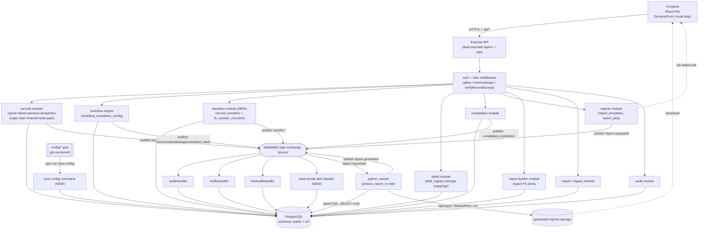
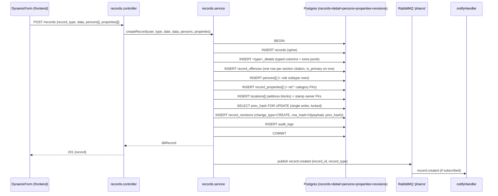
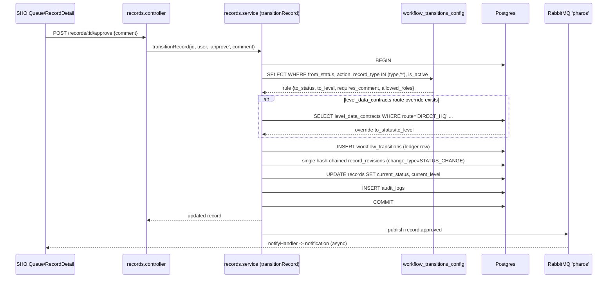
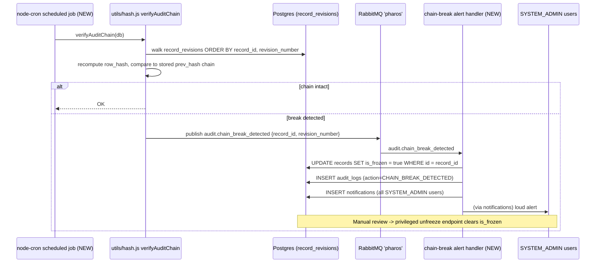
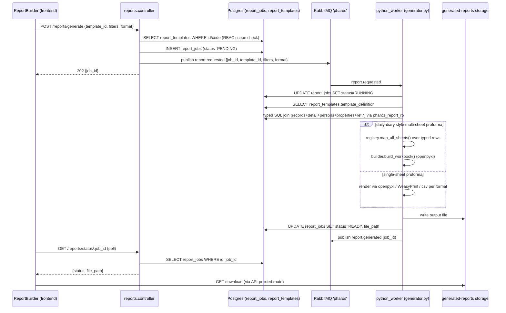
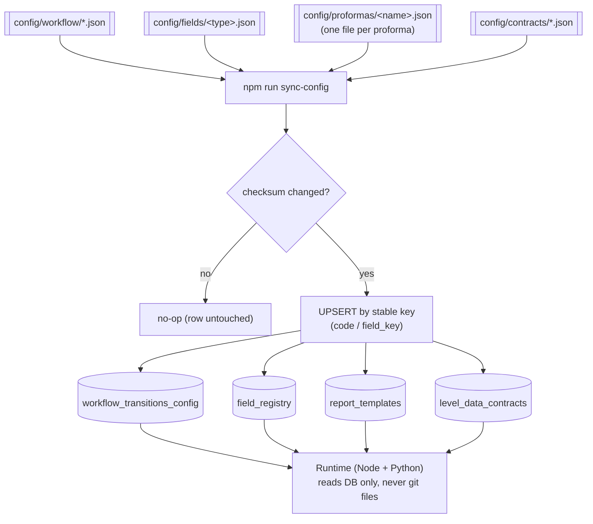
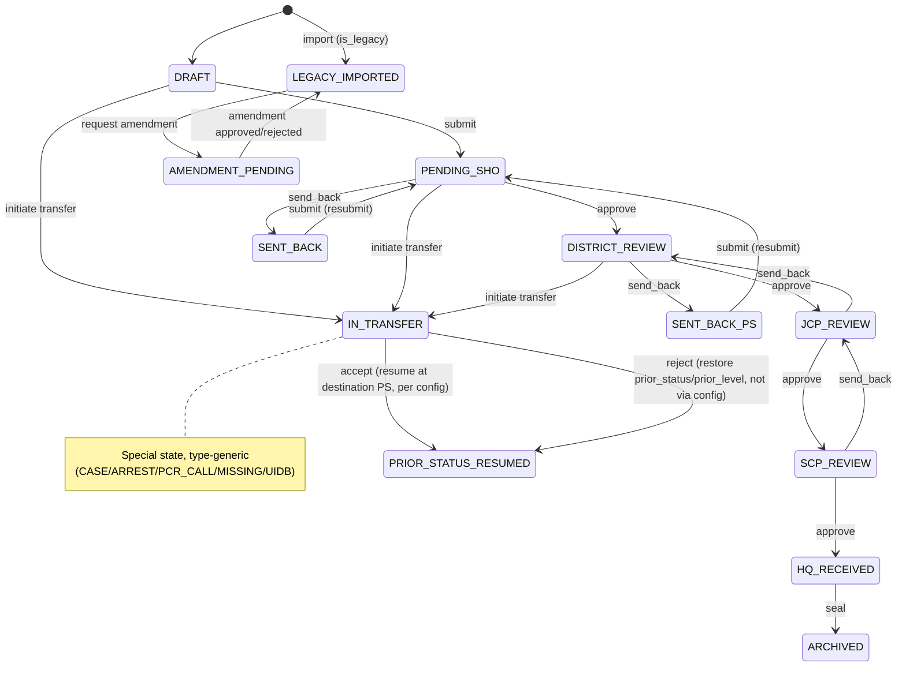

# PHAROS Application Architecture — Diagrams

**Source of truth:** `ARCHITECTURE.md` (this file is its visual rendering — keep in parity). This file and its generated `.drawio` are **new and separate** from the DB-layer `ER_DIAGRAM.md`/`.drawio` — neither of those files, nor any other existing `docs/db-audit/` artifact, was modified to produce this one.
**Open in draw.io:** open **`ARCHITECTURE.drawio`** (same folder) — File → Open in draw.io/diagrams.net. Each diagram below is its own page with native, editable shapes (boxes/arrows for component + flow diagrams, lifelines + ordered messages for sequence diagrams, state nodes + labeled transitions for the state diagram). The file is **generated from this MD** by `generate-architecture-drawio.mjs` — if you edit the Mermaid blocks here, regenerate rather than hand-editing both: `node docs/db-audit/generate-architecture-drawio.mjs`.
**Fallback (Mermaid paste):** draw.io → **Extras → Edit Diagram… → Mermaid** (or **+ / Insert → Advanced → Mermaid**), paste one block, Insert — renders as a static image, same documented fallback already used by `ER_DIAGRAM.md`.
**Notation:** `graph TD`/`flowchart TD` = top-down component/flow diagrams; `sequenceDiagram` = temporal message-passing diagrams (`->>` solid call, `-->>` dashed return, `Note over` for annotations); `stateDiagram-v2` = the workflow status lifecycle.

---

## 1. Overview — component/container diagram



---

## 2. Low-level sequence: typed record write path (create/update)



---

## 3. Low-level sequence: case transfer two-step handshake

```mermaid
sequenceDiagram
    participant SHO_A as SHO (from PS)
    participant API as transfers.controller (NEW)
    participant SVC as transfers.service (NEW)
    participant DB as Postgres
    participant BUS as RabbitMQ 'pharos'
    participant SHO_B as SHO (to PS)

    SHO_A->>API: POST /transfers {record_id, to_ps_id, reason}
    API->>SVC: initiateTransfer(...)
    SVC->>DB: BEGIN
    SVC->>DB: INSERT record_transfers (status=PENDING, prior_status/prior_level snapshot)
    SVC->>DB: transitionRecord(action=initiate) -> current_status=IN_TRANSFER
    SVC->>DB: single hash-chained revision (change_type=TRANSFER)
    SVC->>DB: COMMIT
    SVC->>BUS: publish transfer.initiated
    BUS-->>SHO_B: notifyHandler -> notification row

    SHO_B->>API: POST /transfers/:id/accept
    API->>SVC: acceptTransfer(...)
    SVC->>DB: BEGIN
    SVC->>DB: UPDATE records SET ps_id/district_id/sub_div_id = destination
    SVC->>DB: IF original_ps_id IS NULL THEN SET original_ps_id = pre-transfer ps_id
    SVC->>DB: alt CASE record
        SVC->>DB: UPDATE fir_details.ps_id = destination
        SVC->>DB: SELECT ... FOR UPDATE fir_number_counters(ps_id, fir_year)
        SVC->>DB: allocate next fir_no, UPDATE fir_details.fir_no/fir_year
        SVC->>DB: IF original_fir_no IS NULL THEN SET original_fir_no/_year
        SVC->>DB: UPDATE record_transfers.assigned_fir_no/_year
    end
    SVC->>DB: UPDATE record_transfers SET status=ACCEPTED, decided_by, decided_at
    SVC->>DB: transitionRecord(action=accept) per workflow_transitions_config
    SVC->>DB: single hash-chained revision (change_type=TRANSFER)
    SVC->>DB: COMMIT
    SVC->>BUS: publish transfer.accepted
    BUS-->>SHO_A: notifyHandler -> notification row

    Note over SHO_B,DB: Reject path (alternative): restore current_status/current_level<br/>FROM record_transfers.prior_status/prior_level (not from config)
```

---

## 4. Low-level sequence: workflow transition (config-driven)



---

## 5. Low-level sequence: hash-chain verification + break/freeze



---

## 6. Low-level sequence: unified report generation pipeline



---

## 7. Flowchart: config-as-data sync pipeline



---

## 8. State diagram: workflow status lifecycle


