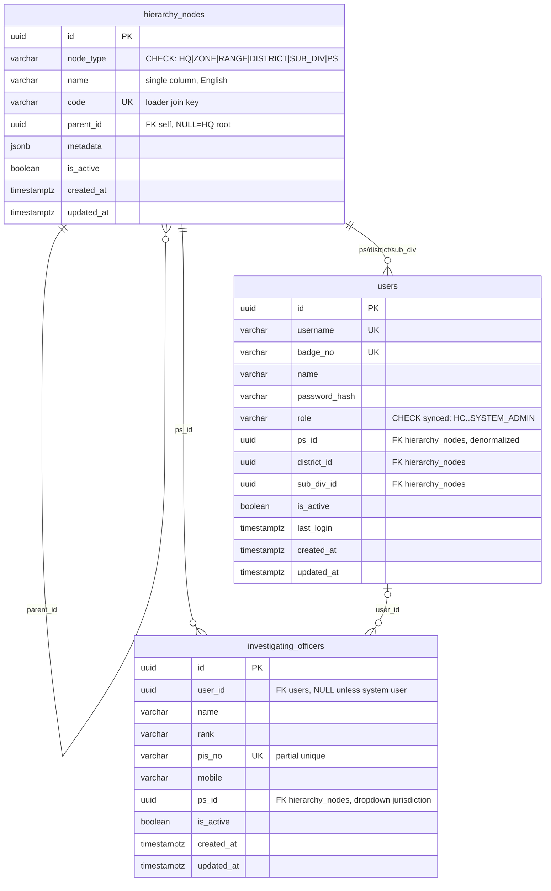
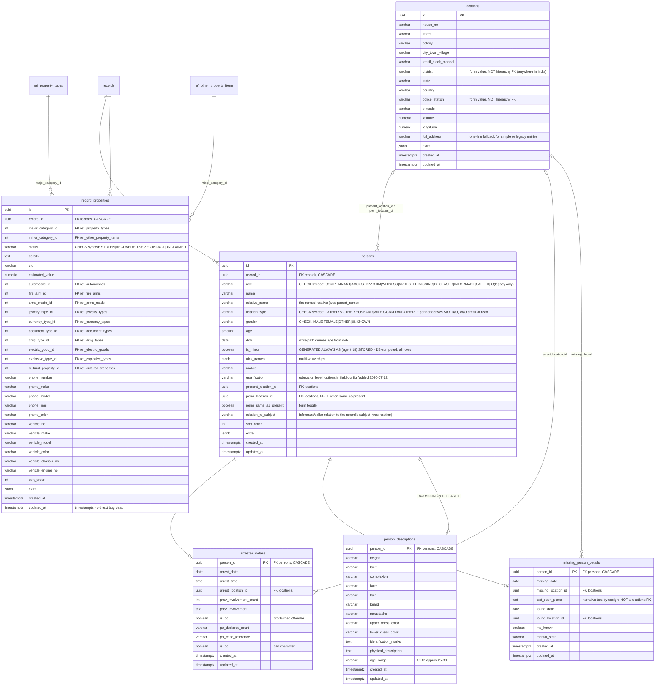
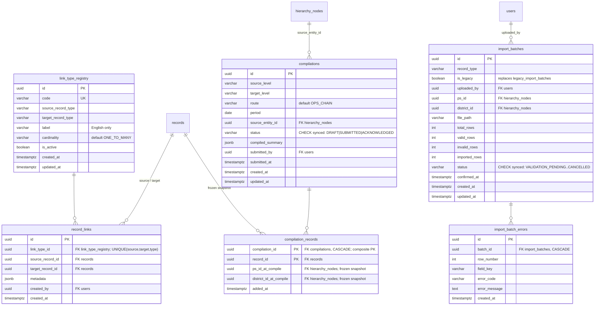
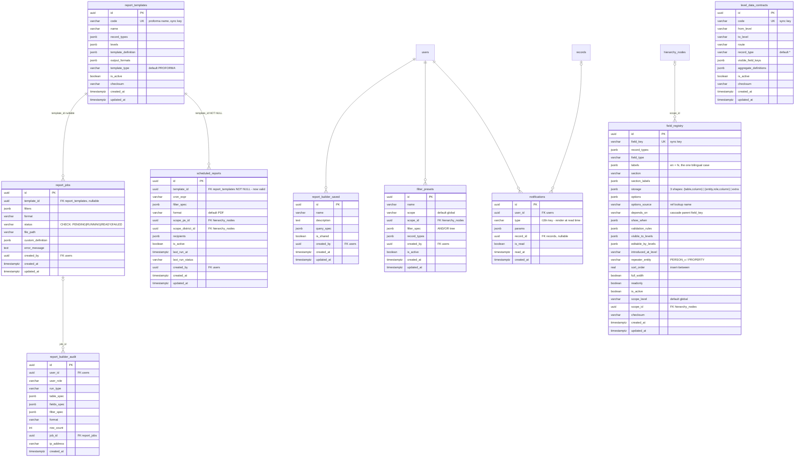

# PHAROS New DB Schema — ER Diagrams

**Source of truth:** `DB_SCHEMA.md` (this file is its visual rendering — kept in parity; column types are simplified here, exact types/lengths live in the spec).
**Open in draw.io:** just open **`ER_DIAGRAM.drawio`** (same folder) — File → Open in draw.io/diagrams.net. It has all 8 diagrams as separate pages with fully editable entity tables and crow's-foot edges; auto-layout is a rough grid, so drag tables around before printing. The file is **generated from this MD** (script: mermaid→draw.io converter) — if you edit the Mermaid blocks here, regenerate it rather than hand-editing both.
**Fallback (Mermaid paste):** draw.io → **Extras → Edit Diagram… → Mermaid** (or **+ / Insert → Advanced → Mermaid**), paste one diagram block (the code between ```` ```mermaid ```` fences), Insert — renders as a static image, not editable shapes. Each section below is one self-contained block — §1 is the printable overview, §2–§8 the full-column domain sheets.
**Notation:** `PK` primary key, `UK` unique, `FK` in the comment (single marker keeps older Mermaid parsers happy). `||--o{` = one-to-many, `||--o|` = one-to-zero-or-one (subtype), `}o--||` = many-to-one. Entities drawn without attributes inside a domain diagram are **stubs** — their columns live in their home domain sheet. `ref.*` schema tables are drawn as `ref_*` (Mermaid names can't contain dots).

---

## 1. Overview — all entities & relationships (no columns)

Supertype/subtype pairs: `records` → 5 detail tables (disjoint, by `record_type`); `persons` → 3 subtype tables (by `role`).

```mermaid
erDiagram
    %% ── Org & identity ──
    hierarchy_nodes ||--o{ hierarchy_nodes : "parent_id"
    hierarchy_nodes ||--o{ users : "ps/district/sub_div"
    hierarchy_nodes ||--o{ investigating_officers : "ps_id"
    users |o--o{ investigating_officers : "user_id"

    %% ── Record spine + subtypes (generalization: record_type) ──
    hierarchy_nodes ||--o{ records : "ps/district/sub_div"
    users ||--o{ records : "created_by"
    investigating_officers |o--o{ records : "io_id"
    records ||--o| fir_details : "CASE"
    records ||--o| arrest_details : "ARREST"
    records ||--o| pcr_call_details : "PCR_CALL"
    records ||--o| missing_details : "MISSING"
    records ||--o| uidb_details : "UIDB"
    records ||--o{ record_offences : "one per section citation"
    ref_sections |o--o{ record_offences : "section_id"

    %% ── Persons (generalization: role), properties & locations ──
    records ||--o{ persons : ""
    persons ||--o| arrestee_details : "ARRESTEE"
    persons ||--o| missing_person_details : "MISSING"
    persons ||--o| person_descriptions : "MISSING or DECEASED"
    records ||--o{ record_properties : ""
    locations |o--o{ persons : "present/perm"
    locations |o--o{ fir_details : "occurrence"
    locations |o--o{ pcr_call_details : "incident/occurrence"
    locations |o--o{ uidb_details : "found"
    locations |o--o{ arrestee_details : "arrest place"
    locations |o--o{ missing_person_details : "missing/found"

    %% ── Classification FKs into ref schema ──
    ref_acts |o--o{ record_offences : "act_id"
    ref_major_heads |o--o{ record_offences : "is_primary row = the crime head"
    ref_minor_heads |o--o{ record_offences : ""
    ref_local_heads ||--o{ fir_details : "heinous via crime_category"
    ref_local_heads ||--o{ arrest_details : ""
    ref_local_heads ||--o{ uidb_details : ""
    ref_beats ||--o{ fir_details : ""
    ref_property_types ||--o{ record_properties : "major"
    ref_other_property_items ||--o{ record_properties : "minor"
    ref_automobiles |o--o{ record_properties : ""
    ref_fire_arms |o--o{ record_properties : ""

    %% ── Workflow, transfers, audit ──
    records ||--o{ record_revisions : "hash chain"
    records ||--o{ workflow_transitions : ""
    records ||--o{ record_transfers : ""
    hierarchy_nodes ||--o{ fir_number_counters : "ps_id"
    records ||--o{ record_amendments : ""
    users ||--o{ audit_logs : "changed_by"

    %% ── Links & compilation ──
    link_type_registry ||--o{ record_links : ""
    records ||--o{ record_links : "source/target"
    hierarchy_nodes ||--o{ compilations : "source_entity"
    compilations ||--o{ compilation_records : ""
    records ||--o{ compilation_records : ""

    %% ── Config-as-data & reporting ──
    field_registry ||..o{ records : "storage mapping"
    workflow_transitions_config ||..o{ workflow_transitions : "governs"
    level_data_contracts ||..o{ records : "level visibility"
    report_templates ||--o{ report_jobs : ""
    report_templates ||--o{ scheduled_reports : ""
    report_jobs |o--o{ report_builder_audit : ""
    users ||--o{ report_builder_saved : ""
    users ||--o{ filter_presets : ""
    users ||--o{ notifications : ""
    records |o--o{ notifications : ""

    %% ── Import ──
    import_batches ||--o{ import_batch_errors : ""
    users ||--o{ import_batches : "uploaded_by"

    %% ── ref schema internal FKs ──
    ref_major_heads ||--o{ ref_minor_heads : ""
    ref_acts ||--o{ ref_major_minor_mapping : ""
    ref_sections ||--o{ ref_major_minor_mapping : ""
    ref_major_heads ||--o{ ref_major_minor_mapping : ""
    ref_arms_categories ||--o{ ref_fire_arms : ""
    ref_other_property_categories ||--o{ ref_other_property_items : ""
    hierarchy_nodes ||--o{ ref_beats : "ps_id"
```



---

## 2. Domain: Org & identity



---

## 3. Domain: Record spine + typed detail subtypes

Disjoint specialization on `records.record_type`; each detail is `1:1`, PK = FK. Placement rule: workflow/scoping/list → spine; type-specific form/report fields → detail. Never duplicated; lists JOIN the detail.

```mermaid
erDiagram
    records ||--o| fir_details : "CASE"
    records ||--o| arrest_details : "ARREST"
    records ||--o| pcr_call_details : "PCR_CALL"
    records ||--o| missing_details : "MISSING"
    records ||--o| uidb_details : "UIDB"
    records ||--o{ record_offences : "one row per section citation"
    ref_sections |o--o{ record_offences : "section_id"
    ref_acts |o--o{ record_offences : "act_id"
    ref_major_heads |o--o{ record_offences : ""
    ref_minor_heads |o--o{ record_offences : ""
    ref_local_heads |o--o{ fir_details : "local_head_id (heinous via crime_category)"
    ref_local_heads |o--o{ arrest_details : ""
    ref_local_heads |o--o{ uidb_details : ""
    locations |o--o{ fir_details : "occurrence_location_id"
    locations |o--o{ pcr_call_details : "incident / occurrence"
    locations |o--o{ uidb_details : "found_location_id"
    hierarchy_nodes ||--o{ records : "ps/district/sub_div"
    investigating_officers |o--o{ records : "io_id"
    users ||--o{ records : "created_by / updated_by / imported_by"

    records {
        uuid id PK
        varchar record_type "CHECK: CASE|ARREST|PCR_CALL|MISSING|UIDB"
        uuid ps_id "FK hierarchy_nodes NOT NULL"
        uuid district_id "FK hierarchy_nodes NOT NULL"
        uuid sub_div_id "FK hierarchy_nodes"
        uuid io_id "FK investigating_officers"
        uuid original_ps_id "FK hierarchy_nodes, write-once on first transfer (any type)"
        varchar current_status "legal set = workflow_transitions_config"
        varchar current_level "CHECK: PS|DISTRICT|JCP|SCP|HQ"
        date record_date
        boolean is_frozen "hash-chain break freeze"
        boolean is_legacy
        varchar source_system
        varchar legacy_ref
        timestamptz imported_at
        uuid imported_by "FK users"
        uuid created_by "FK users"
        uuid updated_by "FK users"
        timestamptz created_at
        timestamptz updated_at
    }
    fir_details {
        uuid record_id PK "FK records, CASCADE"
        uuid ps_id "FK, denormalized for UNIQUE, flipped on transfer"
        varchar fir_no "allocator-assigned, NULL until registered"
        smallint fir_year "UNIQUE(ps_id, fir_year, fir_no)"
        varchar original_fir_no "write-once on first transfer"
        smallint original_fir_year "write-once, original PS lives on records"
        date fir_date
        varchar gd_no
        date gd_date
        time gd_time
        varchar case_type "covers CCTNS / Zero FIR / Manual"
        varchar source_reference
        int beat_id "FK ref_beats"
        boolean is_important
        varchar case_status "domain status, not workflow"
        int local_head_id "FK ref_local_heads; acts+sections+heads live in record_offences"
        text brief_facts
        uuid occurrence_location_id "FK locations"
        timestamptz occurrence_from_datetime "both NULL = time unknown"
        timestamptz occurrence_to_datetime
        timestamptz info_received_at_ps
        boolean organised_crime
        boolean cd_uploaded_24h
        boolean footage_collected
        varchar rc_no
        varchar disposal_type
        jsonb extra "escape hatch, second-class"
        timestamptz created_at
        timestamptz updated_at
    }
    arrest_details {
        uuid record_id PK "FK records, CASCADE"
        varchar gd_no "Kalandra block: required when is_dd_based"
        date gd_date
        time gd_time
        varchar case_type
        varchar case_status
        varchar fir_no "FIR block: required when NOT is_dd_based; as-entered provenance/fallback only — THE link = record_links UUID row (ruling 19)"
        date fir_date
        boolean is_dd_based "arrest-basis discriminator: false=under case, true=standalone Kalandra"
        int local_head_id "FK ref_local_heads; acts+sections+heads in record_offences (own rows, may differ from case)"
        int beat_id "FK ref_beats"
        timestamptz intimation_datetime
        varchar intimated_relative_name
        varchar intimated_relative_relation
        varchar intimation_mode
        boolean nafis_prepared
        boolean dossier_prepared
        varchar arresting_officer_name "contact attribute"
        varchar arresting_officer_mobile
        varchar custody_status
        varchar other_status_reason
        text recovery
        text seizure_desc
        varchar scheme_of_arrest
        boolean integrated_pi
        boolean group_patrolling
        boolean cycle_patrolling
        boolean by_antisnatching_team
        boolean by_prahari
        boolean by_eyes_ears_scheme_members
        jsonb extra
        timestamptz created_at
        timestamptz updated_at
    }
    pcr_call_details {
        uuid record_id PK "FK records, CASCADE"
        varchar pcr_no
        varchar gd_no
        date gd_date
        time gd_time
        varchar call_head
        text call_gist
        uuid incident_location_id "FK locations"
        uuid occurrence_location_id "FK locations"
        timestamptz incident_datetime
        time arrival_time
        text action_taken
        varchar final_call_status
        jsonb extra
        timestamptz created_at
        timestamptz updated_at
    }
    missing_details {
        uuid record_id PK "FK records, CASCADE"
        varchar gd_no
        date gd_date "reference entry date"
        varchar missing_type
        varchar missing_status "domain status"
        varchar operator_name
        varchar source "source of info; PCR-origin is a value here (pcr_call_flag dropped)"
        varchar zipnet_no
        boolean case_registered
        text remarks
        jsonb extra
        timestamptz created_at
        timestamptz updated_at
    }
    uidb_details {
        uuid record_id PK "FK records, CASCADE"
        varchar uidb_no
        varchar gd_no
        date gd_date
        varchar inquest_sections "free text, not FK"
        int local_head_id "FK ref_local_heads; acts+sections+heads in record_offences"
        date found_date
        time found_time
        uuid found_location_id "FK locations"
        varchar duty_officer "contact attribute"
        varchar zipnet_no
        boolean identified
        varchar cause_of_death
        varchar deceased_relative_name "contact attribute"
        varchar deceased_relation_type
        boolean filed_by_acp_sdm
        date filed_by_acp_sdm_date
        text mortuary_remarks
        varchar uidb_status "domain status"
        jsonb extra
        timestamptz created_at
        timestamptz updated_at
    }
    record_offences {
        uuid id PK
        uuid record_id "FK records, CASCADE"
        int act_id "FK ref_acts, NULL if outside lookup"
        varchar other_act_name "CHECK: act_id or other_act_name"
        varchar section_id "FK ref_sections, NULL for free-text acts; one row per section citation (1NF, ruling 17)"
        int major_head_id "FK ref_major_heads; triple repeats across a group's rows"
        int minor_head_id "FK ref_minor_heads"
        boolean is_primary "partial UNIQUE(record_id); the ONE stats head"
        int sort_order
        timestamptz created_at
        timestamptz updated_at
    }
```



---

## 4. Domain: Persons, properties & locations

Specialization on `persons.role`; subtypes only where a role has real extra facts. `person_descriptions` is shared by MISSING and DECEASED (identical block). Person/property facts live ONLY here — never in any jsonb, never in detail tables. `locations` (ruling 15) is the single home for every structured address/place block — one row per use, owned by exactly one referencing row, never shared across records.



---

## 5. Domain: Workflow, transfers, revisions, audit

```mermaid
erDiagram
    records ||--o{ record_revisions : "hash chain per record"
    records ||--o{ workflow_transitions : "ledger"
    records ||--o{ record_transfers : "two-step handshake"
    records ||--o{ record_amendments : ""
    hierarchy_nodes ||--o{ fir_number_counters : "ps_id"
    hierarchy_nodes ||--o{ record_transfers : "from_ps / to_ps"
    users ||--o{ record_revisions : "changed_by"
    users ||--o{ audit_logs : "changed_by_id"
    workflow_transitions_config ||..o{ workflow_transitions : "governs (config)"

    record_revisions {
        uuid id PK
        uuid record_id "FK records, CASCADE; UNIQUE(record_id, revision_number)"
        int revision_number
        varchar change_type "CHECK synced: CREATE|UPDATE|STATUS_CHANGE|LEVEL_TRANSITION|HEAD_OVERRIDE|TRANSFER|AMENDMENT|IMPORT"
        jsonb field_changes
        varchar level
        uuid changed_by "FK users"
        timestamptz changed_at
        text comment
        text reason
        varchar ip_address
        char prev_hash "prior row_hash; genesis constant"
        char row_hash "H(canonical payload + prev_hash)"
        smallint hash_version "canonicalization scheme"
    }
    workflow_transitions {
        uuid id PK
        uuid record_id "FK records, CASCADE"
        varchar from_status
        varchar to_status
        varchar from_level
        varchar to_level
        varchar action
        uuid performed_by "FK users"
        timestamptz performed_at
        text comment
        jsonb target_fields "send-back highlighting"
    }
    workflow_transitions_config {
        uuid id PK
        varchar code UK "sync key"
        varchar record_type "default *"
        varchar from_status
        varchar action
        varchar to_status
        varchar from_level
        varchar to_level
        jsonb allowed_roles
        boolean requires_comment
        int sla_hours
        boolean is_active
        varchar checksum "sync no-op detection"
        timestamptz created_at
        timestamptz updated_at
    }
    record_transfers {
        uuid id PK
        uuid record_id "FK records"
        uuid from_ps_id "FK hierarchy_nodes"
        uuid to_ps_id "FK hierarchy_nodes"
        uuid initiated_by "FK users"
        timestamptz initiated_at
        text reason
        varchar order_ref
        varchar status "CHECK: PENDING|ACCEPTED|REJECTED"
        varchar prior_status "snapshot at initiation; REJECT restores"
        varchar prior_level "snapshot"
        varchar assigned_fir_no "write-once on ACCEPT"
        smallint assigned_fir_year
        uuid decided_by "FK users"
        timestamptz decided_at
        text decision_comment
        timestamptz created_at
        timestamptz updated_at
    }
    fir_number_counters {
        uuid ps_id PK "FK hierarchy_nodes; composite PK"
        smallint fir_year PK
        int last_no "row-locked increment allocator"
        timestamptz updated_at
    }
    record_amendments {
        uuid id PK
        uuid record_id "FK records"
        uuid requested_by "FK users"
        varchar status "CHECK: PENDING|APPROVED|REJECTED"
        jsonb field_changes
        text reason
        uuid decided_by "FK users"
        timestamptz decided_at
        text decision_comment
        timestamptz created_at
        timestamptz updated_at
    }
    audit_logs {
        uuid id PK
        varchar table_name
        uuid record_id "no FK - generic by design"
        varchar action
        uuid changed_by_id "FK users"
        varchar changed_by_role
        timestamptz changed_at
        varchar field_name
        jsonb old_value
        jsonb new_value
        text reason
        varchar ip_address
    }
```



---

## 6. Domain: Links, compilation, import



---

## 7. Domain: Config-as-data & reporting

All three config tables sync from git seed files (`config/workflow|fields|proformas|contracts/*.json`) via `npm run sync-config` (idempotent upsert on `code`/`field_key`, checksum no-op). `field_registry` has **no storage role** — UI metadata + storage mapping only.



---

## 8. Domain: `ref` schema (21 lookups)

Natural code PKs (⚠ = key must be verified against sheet data before migration — composite where needed; loader fails loudly on duplicates). UNIQUE on every code column. English-only labels.

```mermaid
erDiagram
    ref_major_heads ||--o{ ref_minor_heads : "major_head_code"
    ref_acts ||--o{ ref_major_minor_mapping : "act_cd"
    ref_sections ||--o{ ref_major_minor_mapping : "section_code"
    ref_major_heads ||--o{ ref_major_minor_mapping : "major_head_code"
    ref_arms_categories ||--o{ ref_fire_arms : "arms_category_cd"
    ref_other_property_categories ||--o{ ref_other_property_items : "parent_cd"
    hierarchy_nodes ||--o{ ref_beats : "ps_id (org data, enforced)"

    ref_acts {
        int act_cd PK
        text act_long
    }
    ref_sections {
        varchar act_sec_cd PK "verify natural key"
        text section_code UK "FK target for mapping"
        varchar section_cd
        varchar section
        text section_desc
        boolean pnsh_gt_7yrs
    }
    ref_major_heads {
        int major_head_code PK
        varchar major_head
    }
    ref_minor_heads {
        int major_head_code PK "FK ref_major_heads; composite PK, verify"
        int minor_head_cd PK
        varchar minor_head
    }
    ref_major_minor_mapping {
        int sec_mjrhd_cd PK "verify natural key"
        int act_cd "FK ref_acts"
        text section_code "FK ref_sections"
        int major_head_code "FK ref_major_heads"
    }
    ref_local_heads {
        int local_head_cd PK
        varchar local_head
        varchar crime_category "CHECK: HEINOUS|NON_HEINOUS|OTHER; curated overlay, not in source sheet; reports roll OTHER into NON_HEINOUS"
    }
    ref_beats {
        uuid ps_id PK "FK hierarchy_nodes; composite PK"
        varchar beat_cd PK
        text beat_name
    }
    ref_property_types {
        int parent_cd PK "verify natural key"
        int parent_srno
        varchar code_type
        varchar parent_type
        int major_property
    }
    ref_other_property_categories {
        int parent_cd PK "verify natural key"
        int parent_srno
        varchar code_type
        varchar parent_type
        int major_property
    }
    ref_other_property_items {
        int property_cd PK "verify natural key"
        int parent_cd "FK ref_other_property_categories"
        varchar property_type_srno
        varchar property
    }
    ref_fire_arms {
        int fire_arms_cd PK
        int arms_category_cd "FK ref_arms_categories"
        varchar fire_arms
    }
    ref_arms_categories {
        int arms_category_cd PK
        varchar arms_category
    }
    ref_arms_made {
        int arms_made_cd PK
        varchar arms_made
    }
    ref_automobiles {
        int automobile_cd PK
        varchar automobile
    }
    ref_jewelry_types {
        int jewelry_type_cd PK
        varchar jewelry_type
    }
    ref_currency_types {
        int currency_type_cd PK
        varchar currency_type
    }
    ref_document_types {
        int document_type_cd PK
        varchar document_type
    }
    ref_drug_types {
        int drug_type_cd PK
        varchar drug_type
    }
    ref_electric_goods {
        int electric_goods_cd PK
        varchar electric_goods
    }
    ref_explosive_types {
        int explosive_type_cd PK
        varchar explosive_type
    }
    ref_cultural_properties {
        int cultural_prop_cd PK
        varchar cultural_prop
    }
```


